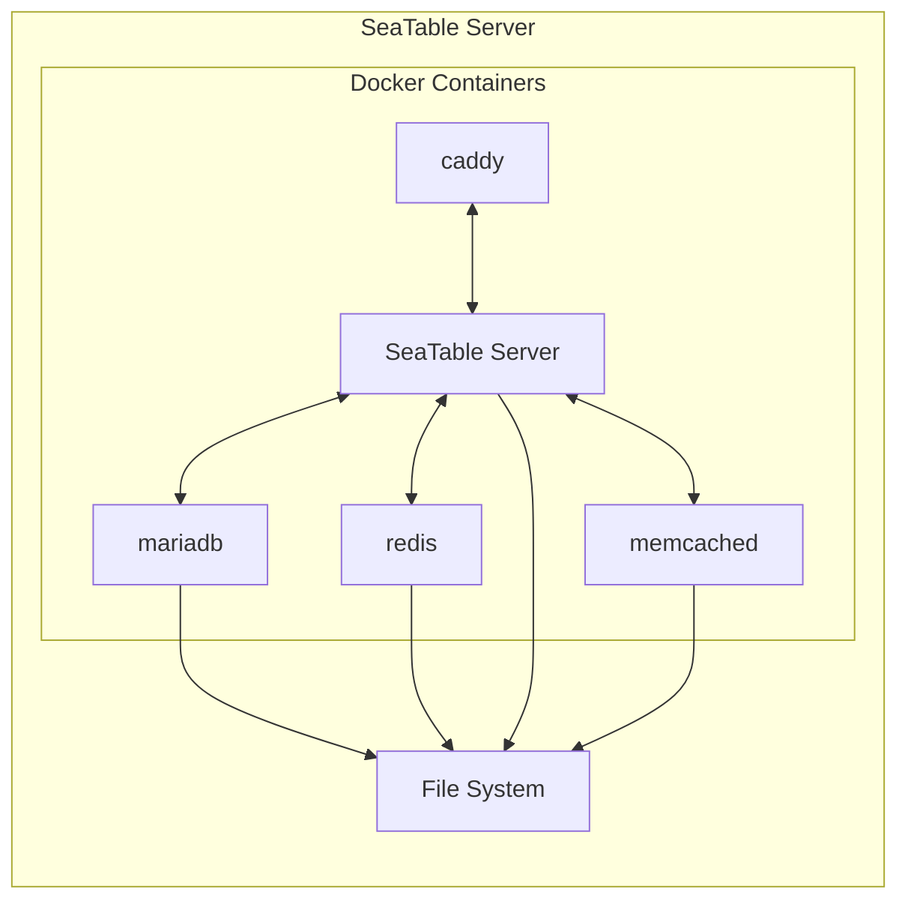
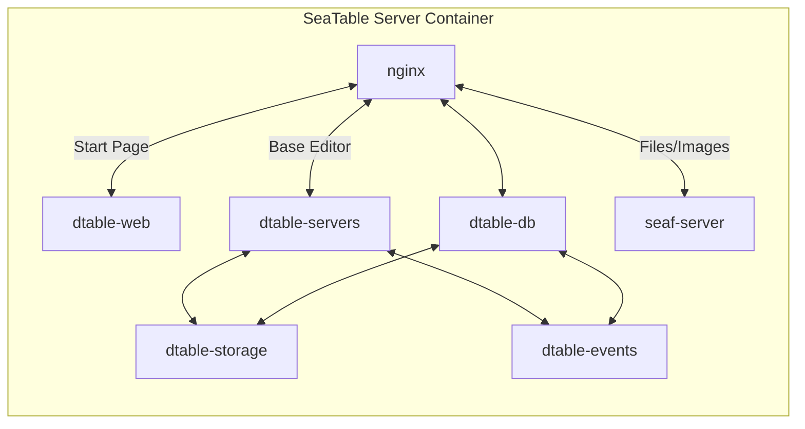

# Architecture

## Docker Containers

A SeaTable Server consists of a handful of docker containers, which are all required to work properly.

Please be aware, that the following graph is highly simplified. More details will be provided later in this manual.

### Caddy: the flexible web proxy

The only task of caddy is to offer a central way into the SeaTable Server. Caddy makes TLS termination with Let's Encrypt or the usage of custom certificates super easy.

### mariadb: the database

Every software that want to save some data needs a database. SeaTable uses mariadb to store persistent data about the users, which bases exist, which groups were created and so on.

**Important:** the content of the SeaTable bases are not stored inside the database.

### redis: Internal events queue

Redis is used for sending messages from dtable-web/dtable-server to dtable-events

### memcache: Caching for the Django framework

Memcache is used to provide caching for Django framework.

## SeaTable Server Container

Let's look at the SeaTable Server container. Also this graph is simplified for explanatory reasons. It should explain the connections and logics and should not be super precise.

SeaTable consists of following component

- dtable-web: The website for manage bases.
- dtable-server: Store the bases and provide collaborating feature.
- dtable-db: Provide big data storage and SQL query interface.
- dtable-events: Background tasks likes email sending and so on.
- seaf-server: Store attachments (files and images).
- dtable-storage-server: An simple abstract layer upon file storage and S3-like object storage.

Some explanation:

- MariaDB, Memcache, Redis are running in their own docker containers.
- Redis is used for sending messages from dtable-web/dtable-server to dtable-events
- All the components use Memcache for storing cache and MariaDB for storing permanent information
- Bases are maintained in dtable-server and periodically saved to dtable-storage-server for persistent storage.
- Attachments are saved in seaf-server, which save to file storage/object storage

## JSON based collaborative

The hearth of a SeaTable Server is the base editor, which allows real-time collaborative work in the browser.

SeaTable stores the base data as json-files in the filesystem (and not in the database). When a user access the base, the json file is loaded into the memory and rendered by the dtable-server.

Every change of the base is stored in memory and also in an operation log in the mariadb. Every 5 minutes, dtable-server automatically saves all changes to the file system.

In addition, the dtable-storage-server creates a snapshot of the base every 24 hours.

!!! warning "Why not store base in Mariadb?"

    In the first moment it sounds counter-intuitive that SeaTable saves the base data in a json file and not the database. The reason for that is that an SQL table is efficient in handling a huge amount of rows. The problem raises in the change of the database structure. Adding new columns, renaming columns, change column types in a table with hundred of thousand of rows it not efficient. Therefore the decision was made to persist the base data into json files instead of storing it directly in the database.

Every base in SeaTable is saved as a json-file. and when users access the base, it will be loaded into dtable-server. When the base is modified, dtable-server automatically saves it to dtable-storage-server every 5 minutes. In addition, dtable-storage-server creates a snapshot of the base every 24 hours.

The base cannot contain more than 100,000 rows. If the records are close to 100,000, the record can be transferred from the file (dtable-server is responsible for management) to the big data storage (dtable-db is responsible for management) through the archive operation. dtable-db periodically saves backups of big data storage to dtable-storage-server.
