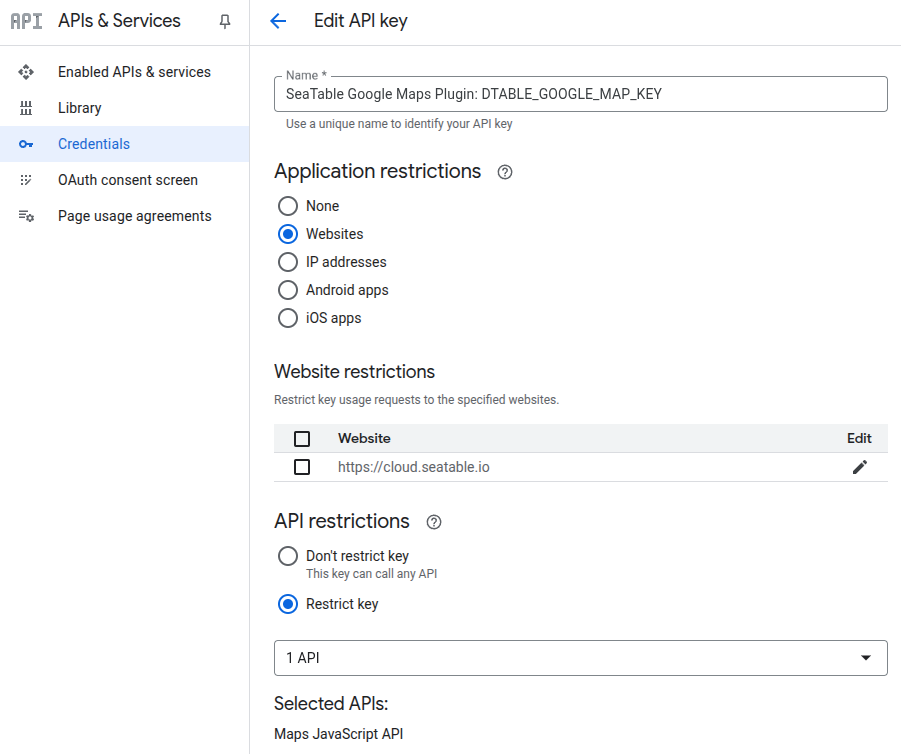

# Plugins

SeaTable Server supports plugins. Plugins provide additional visualization or interaction possibilities within a SeaTable base. Examples of SeaTable plugins include the Gallery, the Map or the Kanban board, providing users with versatile options to visualize their data.

Discover a comprehensive list of publicly available plugins and learn how to leverage them in our [user documentation](https://seatable.io/docs/plugins/alle-plugins-in-der-uebersicht/?lang=auto).

Typically, installation of a plugin requires action from the system administrator on the SeaTable server. Once installed, any user can easily activate the plugin within their base, unlocking its full potential.

## Activation / Update of plugins

System administrators have three distinct methods to install plugins into your SeaTable server. Users or team admins do not have the capability to install plugins.

### Option 1: Installation/Update via Web Interface

Navigate to the system administration area and select **Plugins** from the left navigation bar. Click on **Import plugin from market** and choose the desired plugin. Please ensure that your SeaTable Server has internet access and can download zip files from <https://market.seatable.io>.


After a few moments, the plugin will appear in the list of installed plugins. Subsequently, all users can activate the plugins in any base.

In the event that a new version becomes available, a button will appear on the plugin card. Simply click on this button to initiate the update process for the plugin.


### Option 2: Upload via ZIP-File

If your server lacks internet connectivity, you can still install Plugins by downloading them as ZIP files to your local PC and subsequently uploading them to the SeaTable Server.

The complete plugin archive can be found at the following URL: <https://cloud.seatable.io/apps/custom/plugin-archive>.


After a brief moment, the plugin will appear in the list of installed plugins, allowing all users to activate it in any base.

To update a plugin, simply upload the latest version as a zip file. SeaTable will automatically detect the newer version and update the plugin accordingly.

### Option 3: Plugins via API

SeaTable Server offers API endpoints for installing and updating plugins. For further details, please refer to the API reference documentation.

- <https://api.seatable.com/reference/addplugin>
- <https://api.seatable.com/reference/updateplugin>

## Configuration of the plugins

Typically, plugins do not necessitate additional configuration. However, there are two exceptions:

- the Map plugin, which presently relies on the Google Maps API and requires two API keys.
- the Whiteboard Plugin (tldraw), which requires a separate Docker container.

### Map Plugin

The Map plugin works exclusively with the Google Maps Platform. To enable it, you need two <a href="https://developers.google.com/maps/documentation/javascript/get-api-key?hl=en">Google API keys</a>, each with different permissions:

- Geocoding API
- Maps Javascript API

Using two separate keys is recommended for security and cost control. While technically the same key could be used for both, separating them ensures that your Geocoding API key (which is expensive) is not exposed to end users.

```bash
DTABLE_GOOGLE_MAP_KEY = '<your Maps JavaScript API key here>'
SERVER_GOOGLE_MAP_KEY = '<your Geocoding API key here>'
```


!!! danger "Required scope of the API keys"

    To safeguard your Google API Keys from abuse, restrict their usage. However, even with restrictions in place, abuse remains a risk—especially since `DTABLE_GOOGLE_MAP_KEY` must be included in your source code and is therefore publicly accessible. Additionally, heavy use of the maps plugin may increase your Google billing, so monitor your spending closely.

    | Key | Application restriction | API restriction | 
    | --- | --- | --- |
    | `DTABLE_GOOGLE_MAP_KEY` | Restrict to your Server URL,<br>like `https://cloud.seatable.io` | Maps Javascript API |
    | `SERVER_GOOGLE_MAP_KEY` | **No website restriction** | Geocoding API | 


#### `SERVER_GOOGLE_MAP_KEY`

- Used for **server-side requests** (Geocoding API).  
- **Do not** restrict it to a website (since requests originate from the server).  
- Restrict it instead by **API usage** → only allow the *Geocoding API*.  


#### `DTABLE_GOOGLE_MAP_KEY`

- Used for **client-side requests** (Maps JavaScript API).  
- This key must be embedded in the frontend and will therefore be **publicly visible**.  
- Restrict it to your **SeaTable server’s domain** (HTTP referrers).  
- Allow usage only for the *Maps JavaScript API*.  



Remember to [restart the SeaTable Service](../maintenance/restart-seatable.md) to apply the changes from the updated configuration file.

### Whiteboard Plugin

Please follow this [instruction to install the tldraw container](../installation/components/whiteboard.md) on the same host where the SeaTable Server is running.
