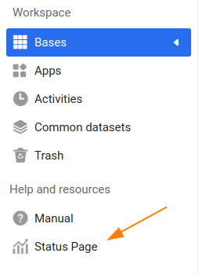

# Additional Navigation Items

SeaTable provides an easy way to add custom navigation items below the _Help and Resources_ section on the left side of the page. For example, you can add a link to a status page (like from Gatus or Uptime Kuma).

Here's how it might look:



## Configuration

To add new items, simply append the following code to your `dtable_web_settings.py`. You can choose from nearly 400 available icons for the `icon` field. Use the search function below to find the perfect one.

```python
CUSTOM_NAV_ITEMS = [
  {
    'icon': 'dtable-icon-app-statistics',
    'desc': 'Status Page',
    'link': 'https://stats.uptimerobot.com/R5GVEtrQK8'
  }
]
```

## Available icons

Search through nearly 400 available icons in SeaTable. Simply type a word and press Enter to view matching results.

<input id="iconSearch" class="md-input md-input--stretch mdx-iconsearch__input" placeholder="Search available icons in SeaTable" data-mdx-component="iconsearch-query" onchange="returnAvailableIcons()">
<div id="iconResults"></div>

<!--
.dtable-icon-recycle-bin1
.dtable-icon-department-single-selection
.dtable-icon-decoration
.dtable-icon-dynamic-materials
.dtable-icon-first-page
.dtable-icon-thumbnail
.dtable-icon-next-page
.dtable-icon-previous-page
.dtable-icon-last-page
.dtable-icon-using-templates
.dtable-icon-ai-assistant
.dtable-icon-down1
.dtable-icon-up1
.dtable-icon-refresh
.dtable-icon-table-of-
.dtable-icon-remove-from-toolbar1
.dtable-icon-add-to-toolbar1
.dtable-icon-add-to-toolbar
.dtable-icon-remove-from-toolbar
.dtable-icon-folders1
.dtable-icon-info-circle
.dtable-icon-handwritten-signature-sync
.dtable-icon-handwritten-signature
.dtable-icon-collapse-all
.dtable-icon-expand-all
.dtable-icon-comment1
.dtable-icon-border-style
.dtable-icon-automation-rules1
.dtable-icon-notification-rules
.dtable-icon-app-purchase
.dtable-icon-app-statistics
.dtable-icon-app-address-book
.dtable-icon-app-product-library
.dtable-icon-app-individual-bill
.dtable-icon-app-email
.dtable-icon-app-distribution
.dtable-icon-app-history1
.dtable-icon-app-contract
.dtable-icon-app-post-sale
.dtable-icon-app-logistics
.dtable-icon-app-invoice
.dtable-icon-app-achievement-distribution
.dtable-icon-underline
.dtable-icon-chart
.dtable-icon-text
.dtable-icon-calendar1
.dtable-icon-data-deduplication
.dtable-icon-advanced-statistics
.dtable-icon-gallery
.dtable-icon-kanban
.dtable-icon-page-design
.dtable-icon-timeline
.dtable-icon-map1
.dtable-icon-upload1
.dtable-icon-qr-code
.dtable-icon-monitor1
.dtable-icon-more
.dtable-icon-italic
.dtable-icon-font-color1
.dtable-icon-clear-format
.dtable-icon-bold
.dtable-icon-display1
.dtable-icon-list-ol1
.dtable-icon-list-ul1
.dtable-icon-activities
.dtable-icon-import-from-another-table1
.dtable-icon-monitor
.dtable-icon-custom-color1
.dtable-icon-switch2
.dtable-icon-justify-align
.dtable-icon-font-color
.dtable-icon-increase-indent
.dtable-icon-decrease-indent
.dtable-icon-list-ol-capital-english-letters
.dtable-icon-list-ol-capital-roman-numerals
.dtable-icon-list-ul
.dtable-icon-list-ul-black-square
.dtable-icon-list-ul-hollow-circle
.dtable-icon-list-ol-small-roman-numerals
.dtable-icon-switch1
.dtable-icon-list-ol-small-english-letters
.dtable-icon-custom-color
.dtable-icon-import-from-another-table
.dtable-icon-list-ol-small-greek
.dtable-icon-list-ol
.dtable-icon-align-right
.dtable-icon-horizontal-center
.dtable-icon-align-left
.dtable-icon-bottom-alignment
.dtable-icon-horizontal-distribution
.dtable-icon-top-alignment
.dtable-icon-vertical-center
.dtable-icon-vertical-distribution
.dtable-icon-novice-guide
.dtable-icon-wide
.dtable-icon-narrow1
.dtable-icon-choose-column
.dtable-icon-app-share
.dtable-icon-app-user-management
.dtable-icon-paused
.dtable-icon-app-preview
.dtable-icon-app-authority-management
.dtable-icon-app-settings
.dtable-icon-rule
.dtable-icon-workflow1
.dtable-icon-app-page
.dtable-icon-app-home
.dtable-icon-app-personnel
.dtable-icon-app-star-mark
.dtable-icon-app-history
.dtable-icon-app-edit
.dtable-icon-app-folder
.dtable-icon-app-calendar
.dtable-icon-app-map
.dtable-icon-app-position
.dtable-icon-app-gallery
.dtable-icon-automation-rules
.dtable-icon-dingtalk
.dtable-icon-delete
.dtable-icon-checklist-sync
.dtable-icon-button-sync
.dtable-icon-email-sync
.dtable-icon-link-formulas-sync
.dtable-icon-location-sync
.dtable-icon-creation-time-sync
.dtable-icon-calendar-alt-solid-sync
.dtable-icon-multiple-selection-sync
.dtable-icon-collaborator-sync
.dtable-icon-picture-sync
.dtable-icon-renewal-person-sync
.dtable-icon-duration-sync
.dtable-icon-single-election-sync
.dtable-icon-autonumber-sync
.dtable-icon-link-other-record-sync
.dtable-icon-formula-sync
.dtable-icon-single-line-text-sync
.dtable-icon-rate-sync
.dtable-icon-file-alt-solid-sync
.dtable-icon-long-text-sync
.dtable-icon-url-sync
.dtable-icon-number-sync
.dtable-icon-periodic-sync
.dtable-icon-table-encryption
.dtable-icon-funnel-chart
.dtable-icon-convert
.dtable-icon-include-archived-records
.dtable-icon-exclude-archived-records
.dtable-icon-use-values
.dtable-icon-restore
.dtable-icon-partially-selected
.dtable-icon-workflow
.dtable-icon-rectangular-tree-diagram
.dtable-icon-scan-code
.dtable-icon-a-qr-code
.dtable-icon-histogram
.dtable-icon-bar-chart
.dtable-icon-line-chart
.dtable-icon-area-chart
.dtable-icon-pie-chart
.dtable-icon-scatter-chart
.dtable-icon-combination-chart
.dtable-icon-map
.dtable-icon-heat-map
.dtable-icon-facet-chart
.dtable-icon-card
.dtable-icon-gauge
.dtable-icon-adjust-column
.dtable-icon-private-archive-view
.dtable-icon-private-database
.dtable-icon-up-move
.dtable-icon-down-move
.dtable-icon-flag
.dtable-icon-praise
.dtable-icon-like
.dtable-icon-mysql-database
.dtable-icon-more-menus
.dtable-icon-pdf
.dtable-icon-export-to-new-table
.dtable-icon-pin
.dtable-icon-night-mode
.dtable-icon-day-mode
.dtable-icon-archiving-view
.dtable-icon-recognition-image
.dtable-icon-archive-view
.dtable-icon-extend
.dtable-icon-delete-row
.dtable-icon-delete-column
.dtable-icon-insert-row-above
.dtable-icon-insert-row-below
.dtable-icon-insert-row-left
.dtable-icon-insert-row-right
.dtable-icon-add_members
.dtable-icon-linkage
.dtable-icon-history
.dtable-icon-find_fill
.dtable-icon-data-processing
.dtable-icon-page-designer
.dtable-icon-rules
.dtable-icon-database
.dtable-icon-rate
.dtable-icon-modify-row
.dtable-icon-enlarge1
.dtable-icon-shrink
.dtable-icon-default-scale
.dtable-icon-current-location
.dtable-icon-edit
.dtable-icon-link-formulas
.dtable-icon-folders
.dtable-icon-row-height-quadruple
.dtable-icon-row-height-triple
.dtable-icon-row-height-double
.dtable-icon-row-height-default
.dtable-icon-data-collection-table
.dtable-icon-repeat-value-highlight
.dtable-icon-enterprise-wechat1
.dtable-icon-button
.dtable-icon-send-backward
.dtable-icon-bring-forward
.dtable-icon-bring-to-front
.dtable-icon-send-to-back
.dtable-icon-transfer-deposit
.dtable-icon-revoke
.dtable-icon-redo
.dtable-icon-tip
.dtable-icon-currency
.dtable-icon-narrow
.dtable-icon-enlarge
.dtable-icon-page-size
.dtable-icon-duration
.dtable-icon-system-message
.dtable-icon-recycle-bin
.dtable-icon-abuse-report
.dtable-icon-email
.dtable-icon-share-with-me
.dtable-icon-department
.dtable-icon-api
.dtable-icon-help-center
.dtable-icon-ask-community
.dtable-icon-keyboard-shortcuts
.dtable-icon-member-free
.dtable-icon-down
.dtable-icon-up
.dtable-icon-list-view
.dtable-icon-script
.dtable-icon-implement
.dtable-icon-autonumber
.dtable-icon-color
.dtable-icon-wechat
.dtable-icon-condition-set
.dtable-icon-full-screen
.dtable-icon-video
.dtable-icon-retry
.dtable-icon-print
.dtable-icon-batch-replacement
.dtable-icon-permissions
.dtable-icon-sync
.dtable-icon-member
.dtable-icon-organization-name
.dtable-icon-star
.dtable-icon-todo
.dtable-icon-rotate
.dtable-icon-comment
.dtable-icon-camera
.dtable-icon-check-circle
.dtable-icon-exclamation-circle
.dtable-icon-exclamation-triangle
.dtable-icon-eye
.dtable-icon-eye-slash
.dtable-icon-random-generation
.dtable-icon-hi
.dtable-icon-leave
.dtable-icon-history-mirror-image
.dtable-icon-location
.dtable-icon-insert-left
.dtable-icon-insert-right
.dtable-icon-ascending-order
.dtable-icon-descending-order
.dtable-icon-creat-empty-table
.dtable-icon-import
.dtable-icon-picture-linear
.dtable-icon-creation-time
.dtable-icon-upload
.dtable-icon-update
.dtable-icon-assembly
.dtable-icon-description
.dtable-icon-enterprise-wechat
.dtable-icon-statistic
.dtable-icon-common-dataset
.dtable-icon-link-common-dataset
.dtable-icon-notice
.dtable-icon-all-read
.dtable-icon-modification-record
.dtable-icon-copy-link
.dtable-icon-retract-com
.dtable-icon-mark
.dtable-icon-open-com
.dtable-icon-export
.dtable-icon-copy
.dtable-icon-display
.dtable-icon-retract
.dtable-icon-label
.dtable-icon-personal
.dtable-icon-organization1
.dtable-icon-left
.dtable-icon-right
.dtable-icon-link-other-record
.dtable-icon-url
.dtable-icon-calendar
.dtable-icon-use-help
.dtable-icon-relation
.dtable-icon-formula
.dtable-icon-token
.dtable-icon-x-
.dtable-icon-bell
.dtable-icon-confirm
.dtable-icon-cancel
.dtable-icon-menu
.dtable-icon-x
.dtable-icon-settings
.dtable-icon-admin-op-log
.dtable-icon-groups
.dtable-icon-info
.dtable-icon-mine
.dtable-icon-libraries
.dtable-icon-organization
.dtable-icon-discussion
.dtable-icon-add-line
.dtable-icon-table
.dtable-icon-invite
.dtable-icon-broken-line
.dtable-icon-pie
.dtable-icon-modify-column-type
.dtable-icon-journal
.dtable-icon-freeze
.dtable-icon-cancel-freeze
.dtable-icon-permission-setting
.dtable-icon-share
.dtable-icon-set-up
.dtable-icon-form
.dtable-icon-group
.dtable-icon-statistics
.dtable-icon-apps
.dtable-icon-templates
.dtable-icon-files
.dtable-icon-upward
.dtable-icon-unlock
.dtable-icon-lock
.dtable-icon-creator
.dtable-icon-collaborator
.dtable-icon-hide
.dtable-icon-switch
.dtable-icon-add-table
.dtable-icon-add
.dtable-icon-add-square
.dtable-icon-more-vertical
.dtable-icon-more-level
.dtable-icon-card-view
.dtable-icon-search
.dtable-icon-delete-table
.dtable-icon-folder
.dtable-icon-file
.dtable-icon-filter
.dtable-icon-dtable-logo
.dtable-icon-attachments
.dtable-icon-long-text
.dtable-icon-multiple-selection
.dtable-icon-check-mark
.dtable-icon-return
.dtable-icon-main-view
.dtable-icon-sort
.dtable-icon-single-election
.dtable-icon-fork-number
.dtable-icon-add-files
.dtable-icon-drag
.dtable-icon-open
.dtable-icon-download
.dtable-icon-right-slide
.dtable-icon-left-slide
.dtable-icon-picture
.dtable-icon-single-line-text
.dtable-icon-check-square-solid
.dtable-icon-rename
.dtable-icon-drop-down
.dtable-icon-rich-text
.dtable-icon-number
.dtable-icon-file-alt-solid
.dtable-icon-calendar-alt-solid
-->
