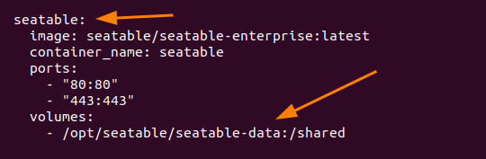
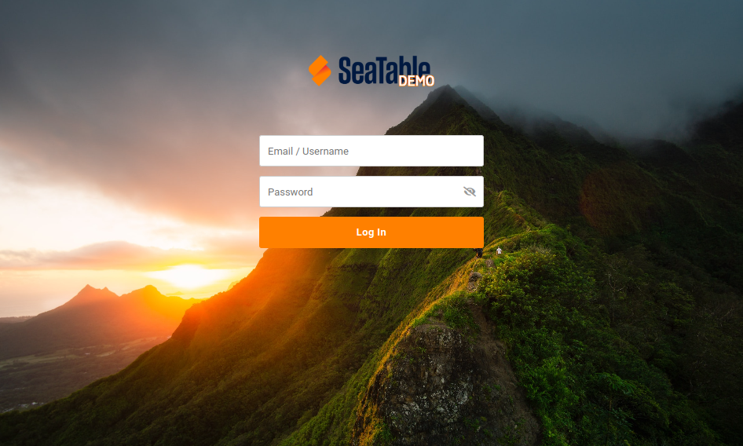

# SeaTable Frontend Modification

With the help of [dtable_web_settings.py](/config/dtable_web_settings/) SeaTable offers a wealth of configuration options to enable or disable individual functions in the frontend or to customize the frontend to your own needs.

At the same time, you can only intervene in the design of the frontend to a limited extent with the help of the configuration files. For this, SeaTable offers a sophisticated template system to selectively replace individual page areas with their own versions.

This article introduces this form of customizing.

## What can be customized?

SeaTable uses predefined HTML templates for almost all web pages and emails, which can be customized. Changes to the base editor are thus not possible, but adjustments to the login page or changes to individual email texts are possible without problems.

The basic idea is simple. You take the files provided by seatable and copy them to a special place outside the container. These copied files can then be customized. If SeaTable (after a restart) finds these files, they will be used instead of the original files. The duplicated and customized files are stored outside the SeaTable docker container, so that the customizations survive an update vno seatable.

All files below `/opt/seatable/seatable-server-latest/dtable-web/seahub/templates/` (inside the SeaTable container) can be customized. Here are a few examples that lend themselves to this:

- **404.html**: Error page, if the URL is not available.
- **500.html**: Error page, in case of a critical error
- **registration/login.html**: Login page
- **registration/logout.html**: Logout page
- **registration/registration_form.html**: Self-registration page
- **registration/activation_email.html**: E-Mail after self-registration (if activation is required)
- **shared_link_email.html**: E-Mail if somebody shares a link with another user

There are many more files, and all of them can be customized.

## How to customize these files?

The basic approach is simple. Create a custom folder in your host system (usually `/opt/seatable/seatable-data/seatable/seahub-data/custom`) and copy the files you want to change to this folder. After a restart SeaTable will check for existing files in your custom directory and replace the original files with the new ones.

**IMPORTANT NOTES:**

1. Files must not be renamed. If the file is called `404.html`, then the file has to keep this name. Otherwise the replacement with your custom files will not work.
2. Keep the files in the same directory structure. If you want to replace `registration/login.html`, then you have to create a folder `registration` in your custom folder and copy the file `login.html` to this new directory.

Imagine this customizing like an overlay. SeaTable takes the original files from inside the container. If SeaTable finds the files with the same name in the same directory structure, it replaces the original files.

## Example: new login page

Imagine you want to replace the login page of SeaTable with something fancier. Here is what you have to do. The following example assumes that your SeaTable docker container is called `seatable` and that your mounted docker volume is located at `/opt/seatable/seatable-data`. Please check your docker-compose.yml and change the following examples if necessary.



### 1. Create custom folder

This step must be done only once. It generates the setup that you can start overwrite existing html-files from SeaTable with your own ones. You need the folder to save the copies outside of your docker container and you need a symlink that SeaTable can find your custom files.

```
cd /opt/seatable/seatable-data/seatable/seahub-data
mkdir -p custom/templates/registration
docker exec -it seatable ln -s /shared/seatable/seahub-data/custom /opt/seatable/seatable-server-latest/dtable-web/media/custom
```

### 2. Copy the original login.html to your custom folder

```
$ docker cp seatable:/opt/seatable/seatable-server-latest/dtable-web/seahub/templates/registration/login.html /opt/seatable/seatable-data/seatable/seahub-data/custom/templates/registration/login.html
```

### 3. Adapt the login.html according to your needs

Now you can start editing your login.html. Otherwise you can take one of these examples (tested with SeaTable 4.0.x):

**Example 1: Simple login form**



Copy the following content to your login.html. As you can see, the login page was reduced to the maximum. There is no box around the input fields, there is no _language selector_, no _single sign on_, no _signup_ or _forget password_. Error messages are still shown and security features like _CSCF_ and _Captcha_ is still part of the login page.

```



.show-password-toggle {
    position: absolute;
    top: 8px;
    right: 10px;
    cursor: pointer;
    color: #999;
}
.show-password-toggle:hover {
    color: #666;
}
.login-panel {
  background: none;
  border-radius: none;
  box-shadow: none;
}
.vh {
  visibility: inherit !important;
}


<div class="login-panel-outer-container mt-6 vh">
<div class="login-panel">
    <form action="" method="post" id="login-form">
        <input type="text" name="login" placeholder="Email / Username" %}" aria-label="" title="" value="" class="input name-input" /><br />
        <div class="position-relative">
            <input type="password" name="password" placeholder="" aria-label="" title="" value="" class="input passwd-input" id="id_password1" autocomplete="off" />
            <span class="show-password-toggle dtable-font dtable-icon-eye-slash"></span>
        </div>
        
        <div class="ovhd">
            <span id="refresh-captcha" title="" class="icon-refresh op-icon fright"></span>
            {{ form.captcha }}
        </div>
        
        <input type="hidden" name="next" value="{{ next|escape }}{{ SITE_ROOT }}" />
        
        
        {{ form.captcha.errors}}
        
        <p class="error">{{ form.errors.freeze_account }}</p>
        
        <p class="error">{{ form.errors.inactive }}</p>
        
        <p class="error">{{ form.errors.not_found }}</p>
        
        <p class="error">{{ form.password.errors }}</p>
        
        <p class="error"></p>
        
        
        <p class="error hide"></p>
        
        <input type="hidden" name="member_me" value="on" />
        <button type="submit" class="submit btn btn-primary btn-block"></button>
    </form>
</div>
</div>


<script type="text/javascript">
$('[name="login"]').trigger('focus');
function setCaptchaInputWidth() {
    $('#id_captcha_1').outerWidth($('.input').outerWidth() - $('.captcha').width() - $('#refresh-captcha').outerWidth(true) - 10);
}
$(window).on('load', setCaptchaInputWidth);
$('.captcha').on('load', setCaptchaInputWidth);
$('#refresh-captcha').on('click', function() {
    $.ajax({
        url: '',
        dataType:'json',
        cache:false,
        success: function(data) {
            $('.captcha').attr('src', data['image_url']);
            $('#id_captcha_0').val(data['key']);
        },
        error: function() {
            $('.error').removeClass('hide').html("");
        }
    });
    return false;
});
$("body").on('click', '.show-password-toggle', function(){
    var $pass1 = document.getElementById("id_password1");
    if ($pass1.type === "password") {
        $pass1.type = "text";
    } else {
        $pass1.type = "password";
    }
    $(this).toggleClass("dtable-icon-eye-slash dtable-icon-eye")
});
$('#login-form').on('submit', function(){
    if (!$.trim($('input[name="login"]').val())) {
        $('.error').removeClass('hide').html("");
        return false;
    }
    if (!$.trim($('input[name="password"]').val())) {
        $('.error').removeClass('hide').html("");
        return false;
    }
});
$(function() {
    $('input:not([type="hidden"])').each(function(index) {
        $(this).attr('tabindex', index + 1);
    });
});
</script>

```

### 4. Restart seatable service

Only one command is missing to restart SeaTable and to activate your new login page.

```
docker exec -d seatable /shared/seatable/scripts/seatable.sh restart
```

## Translation

In the HTML files you will see strings like ``. This is a placeholder, that will be replaced by other language strings depending on which language the user has selected. Translations and changes to these language strings is not part of this article. There will be another article in the near future.
