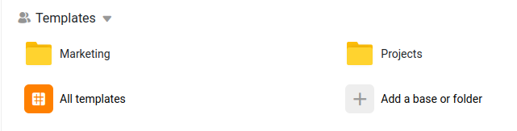

# Templates

<!-- md:version 1.6 -->

Templates offer a convenient method for offering predefined base structures to your users. Adding and managing templates in SeaTable is straightforward since each template is just a SeaTable base and essentially all templates are managed in a **main template** base..

Simply by adding a row to the designated **main template** base, it instantly becomes available in the list of templates.


Sounds easy? Actually it is easy.

## Establishing Your Template Base

To begin, you'll need to create a base that will serve as the repository for all the templates you intend to offer your users. Let's call this the **main template** base.

### Recommended Structure

Here's a suggested approach for organizing your templates:

1. **Create a New Group**: Start by creating a group titled `Templates`.
1. **Main Template Base**: Within this group, set up a base named `All templates`.
1. **Organize Categories**: Utilize folders within the group to categorize your templates based on different themes or purposes.
1. **Template Creation**: Create individual bases within each category folder to accommodate your various templates.

1. Create a new group with the name `Templates`
1. in this group, there will be a base with the name `All templates`.
1. Add folders in your group for each category you would like to provide.
1. Create as many bases in the category folder as you want.

Here's an example of how the structure might appear. In this illustration, I've included folders for both _Marketing_ and _Projects_ categories.



### Creating the Main Template Base

You have two options for setting up the master template base:

??? "Option 1: Download and Import"

    The simplest method is to download our predefined dtable file and import it into your SeaTable server to create the **main template** base.

    [Download our predefined template base](../downloads/All templates.dtable){ .md-button .md-button--primary }

??? "Option 2: Create it from Scratch"

    Alternatively, you can create the base from scratch. Your base should include the following columns:

    - **name** [text]: An internal name for distinguishing between different templates.
    - **category** [single-select]: Categorization of the template.
    - **display_name** [text]: The name of the template displayed on the website.
    - **description** [long-text]: Introduction and suggestions for the template.
    - **card_image** [image]: Image displayed on the template panel.
    - **card_image_expanded** [image]: Image displayed in the template detail dialog.
    - **link** [url]: The sharing link for the specific template.

    Ensure that the table name is `templates`. You can name the base whatever you prefer.

Below is an example of how the **main template** base could be structured:


### Recommended size of template images

To ensure optimal display in the SeaTable **main template**, please provide two different images with the following dimensions:

- **card_image**: 560 x 240 pixels
- **card_image_expanded**: 1840 x 400 pixels

## Create your Templates

Now it's time to create your initial bases, which you'll offer as templates. As recommended, organize these templates within folders.

Once you've created your bases, you'll need to generate **external links** for each base and paste them into your master template base. Refer to this help article from the user documentation on [how to create external links](https://seatable.io/docs/freigaben/externer-link-erklaert/?lang=auto)..

You can add more templates to your **main template** base at any time. They'll be immediately accessible to all users, and no restart is required.

## Generate an API Token for Your Base

Now that you've set up your master base and created some template bases, it's time to generate an API token for the master base. Refer to this help article from the user documentation on [how to create an API token](https://seatable.io/docs/seatable-api/erzeugen-eines-api-tokens/?lang=auto).

Make sure to note down the API token as you'll need it for the next step.

## Activate templates in SeaTable

Equiped with API token and your template base, you can activate the templates in your SeaTable Server.

Add the following lines to `dtable_web_settings.py` and restart SeaTable service.

```bash
TEMPLATE_BASE_API_TOKEN = 'replace-with-your-api-token'
TEMPLATE_TABLE_NAME = 'templates'
ENABLE_CREATE_BASE_FROM_TEMPLATE = True
SHOW_TEMPLATES_LINK = True
```

:partying_face: **Congratulations!** Every user can now use these templates.
