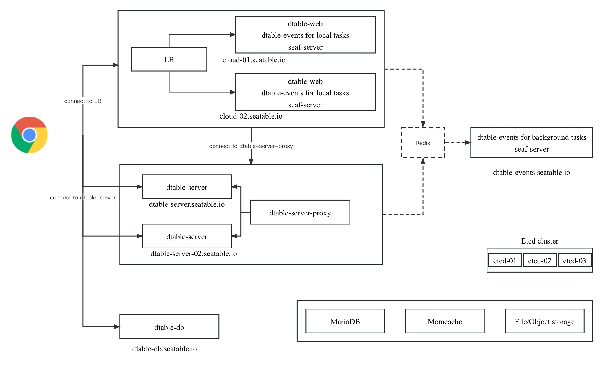

# SeaTable cluster

SeaTable Enterprise Edition support cluster for high availability and better performance.

A general architecture is like following:



All nodes use the same docker image, with a different docker compose file and seatable-controller.conf to control the behavior.

There are five external service needed for the cluster:

1. MariaDB/MySQL service
2. Redis, used as a way to pass event from one component to others
3. Memcached
4. Object storage
5. [Etcd](https://etcd.io/), a reliable key-value storage to store information about which base assigned to which dtable-server

The cluster consistents of the following components:

1. Several dtable-web nodes behind a load balance
2. Several dtable-server nodes, each with its domain, need to be accessed via the clients (browsers) via websockets directly
3. A dtable-db node, as dtable-db has a high performance, there is no need to have several dtable-db nodes yet.
4. A background dtable-events node for background tasks, like sending emails.

There is also a dtable-server proxy node which provide API access to dtable-servers for other components. So that other components don't need to know there are several dtable-servers, and don't need to know which base is assigned to which dtable-server.

Note, to improve performance of your SeaTable service, you don't need to setup a full cluster. Sometimes, use a standalone dtable-server can help improve performance. In the following manual, we will show the steps to setup a two nodes deployment:

* A dtable-web node running dtable-web, seaf-server, dtable-events, dtable-db and dtable-storage-server
* A dtable-server node running dtable-server, dtable-storage-server

Note, dtable-storage-server provide access to the underlying object storage system, so it need to be run at each nodes.

## Setup dtable-web nodes

First, setup a one node deployment according to [Enterprise-Edition](<../../docker/Enterprise-Edition/Deploy SeaTable-EE with Docker.md>)

Then, use storage backend according to [S3 Object Storage](<../../config/enterprise/S3.md>)

### Modify configuration file

Modify `docker-compose.yml` to let Redis can be accessed from another node

```
  redis:
    image: redis:5.0.7
    container_name: seatable-redis
    ports:
      "192.xx.xx.xx:6379:6379"   # dtable-web server's IP

```

Modify dtable-web configuration file  `/Your SeaTable data volume/seatable/conf/dtable_web_settings.py`

```
USE_INNER_DTABLE_SERVER = False
DTABLE_SERVER_URL = 'https://dtable-server.example.com/'  # dtable-server's url
DTABLE_SOCKET_URL = 'https://dtable-server.example.com/'  # dtable-server's url

```

Modify dtable-db configuration file  `/Your SeaTable data volume/seatable/conf/dtable-db.comf`

```
[dtable cache]
private_key = "xxx"
dtable_server_url = "https://dtable-server.example.com/"
total_cache_size = 100
```

Create configuration file :  `/Your SeaTable data volume/seatable/conf/seatable-controller.conf`

```sh
ENABLE_SEAFILE_SERVER=true
ENABLE_DTABLE_WEB=true
ENABLE_DTABLE_SERVER=false
ENABLE_DTABLE_DB=true
ENABLE_DTABLE_STORAGE_SERVER=true
ENABLE_DTABLE_EVENTS=true
DTABLE_EVENTS_TASK_MODE=all

```

DTABLE_EVENTS_TASK_MODE can be all, foreground, background. Here we use all. If you want to deploy a separate background node for running dtable-events, use foreground here.

### Restart dtable-web server

```sh
docker compose up -d

docker exec -it seatable bash

seatable.sh

```

When you see following in the output log, it means success:

```
Skip dtable-server

SeaTable started

```

## Setup dtable-server

### Copy and modify docker-compose.yml

The default directory for SeaTable is `/opt/seatable`. Create the directory:

```
mkdir /opt/seatable

```

**Copy the docker-compose.yml file on the dtable-web server and modify docker-compose.yml.**

vim /opt/seatable/docker-compose.yml

```
services:
  seatable:
    image: seatable/seatable-enterprise:latest
    container_name: seatable
    ports:
      - "80:80"
      - "443:443"  # If https is enabled, cancel the comment.
    volumes:
      - /opt/seatable/shared:/shared  # Requested, specifies the path to Seafile data persistent store.
    environment:
      - SEATABLE_SERVER_HOSTNAME=dtable-server.example.com # Specifies your host name if https is enabled
      - SEATABLE_SERVER_LETSENCRYPT=True
      - TIME_ZONE=Asia/Shanghai # Optional, default is UTC. Should be uncomment and set to your local time zone.
    networks:
      - dtable-net

networks:
  dtable-net:

```

### Copy and modify configuration file

**Prepare configuration file directory**

```
mkdir -p /opt/seatable/shared/seatable/conf

```

**Copy the configuration file on the dtable-web server to the conf directory.**

Modify the dtable-server configuration file :  `/Your SeaTable data volume/seatable/conf/dtable_server_config.json`

```sh
{
    "host": "mysql host",
    "user": "mysql uer",
    "password": "password",
    "database": "dtable_db",
    "port": 3306,
    "private_key": "xxx",
    "dtable_web_service_url": "xxx",  # dtable-web server's URL
    "redis_host": "192.xx.xx.xx",   # dtable-web server's IP
    "redis_port": 6379,
    "redis_password": ""
}

```

Modify the Nginx configuration file : `/Your SeaTable data volume/seatable/conf/nginx.conf` 

```
log_format your_log_format '[$time_iso8601] $http_x_forwarded_for $remote_addr "$request" $status $body_bytes_sent "$http_referer" "$http_user_agent" $upstream_response_time';

upstream dtable_servers {
    server 127.0.0.1:5000;
    keepalive 15;
}

server {
    if ($host = dtable-server.example.com) {
        return 301 https://$host$request_uri;
    }
    listen 80;
    server_name dtable-server.example.com;
    return 404;
}

# This part of the configuration is for communication among nodes within the cluster.
server {
    server_name 172.xx.xx.xx;
    listen 80;

    proxy_set_header X-Forwarded-For $remote_addr;

    location / {
        if ($request_method = 'OPTIONS') {
            add_header Access-Control-Allow-Origin *;
            add_header Access-Control-Allow-Methods GET,POST,PUT,DELETE,OPTIONS;
            add_header Access-Control-Allow-Headers "deviceType,token, authorization, content-type";
            return 204;
        }

        proxy_pass         http://dtable_servers;
        ...
        access_log      /path/to/dtable-server-inner.access.log your_log_format;
        error_log       /path/to/dtable-server-inner.error.log your_log_format;
    }
}

server {
    server_name dtable-server.example.com;
    listen 443 ssl;
    ssl_certificate /shared/ssl/<your-ssl.cer>;
    ssl_certificate_key /shared/ssl/<your-ssl.key>;

    proxy_set_header X-Forwarded-For $remote_addr;

    location /socket.io {
        proxy_pass http://dtable_servers;
        ...
        access_log      /path/to/socket-io.access.log your_log_format;
        error_log       /path/to/socket-io.error.log your_log_format;
    }

    location / {
        if ($request_method = 'OPTIONS') {
            add_header Access-Control-Allow-Origin *;
            add_header Access-Control-Allow-Methods GET,POST,PUT,DELETE,OPTIONS;
            add_header Access-Control-Allow-Headers "deviceType,token, authorization, content-type";
            return 204;
        }

        proxy_pass         http://dtable_servers;
        ...
        access_log      /path/to/dtable-server.access.log your_log_format;
        error_log       /path/to/dtable-server.error.log your_log_format;
    }
}


```

Create configuration file :  `/Your SeaTable data volume/seatable/conf/seatable-controller.conf`

```sh
ENABLE_SEAFILE_SERVER=false
ENABLE_DTABLE_WEB=false
ENABLE_DTABLE_SERVER=true
ENABLE_DTABLE_DB=false
ENABLE_DTABLE_STORAGE_SERVER=true
ENABLE_DTABLE_EVENTS=false
DTABLE_EVENTS_TASK_MODE=all

```

### Start dtable-server

```sh
docker compose up -d

docker exec -it seatable bash

seatable.sh

```

When you see following in the output log, it means success:

```
Skip seafile-server
Skip dtable-events
Skip dtable-web
Skip dtable-db

SeaTable started

```
