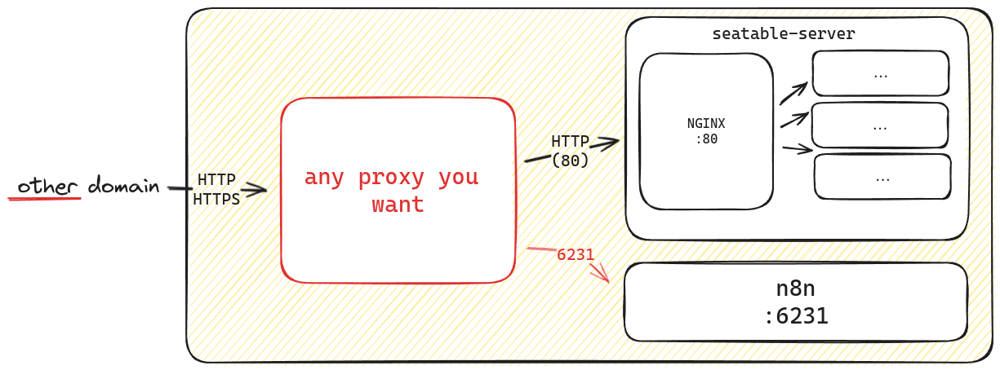

# Replace caddy with another proxy

The Single-Node Installation describes an installation of a SeaTable server with the webserver caddy. We dediced to use Caddy because it simplifies the handling of let's encrypt certificates.
If you create a DNS entry and point it to your server, caddy will do everything else for you. Also we configured caddy with state of the art security configurations.

## Custom proxy with SeaTable Server

But of cause there might be reasons when you want to replace caddy with another proxy like ha-proxy, traffik, nginx, apache etc. The logic of replacing might be simple.

You can use any proxy as long as your forward all traffic to the SeaTable Server. Part of the SeaTable Server container is a nginx web proxy, which routes the traffic by URL. This port 80 is not exposed therefore your proxy has to be in the same docker network like SeaTable Server.

## How to configure

Remove `caddy.yml` from COMPOSE_FILE from .env file. Restart all docker containers. Forward all traffic to the SeaTable Container via port 80.

!!! warning "SeaTable does not expose any ports"

    Please be aware that SeaTable does not expose port 80 to the outside. Therefore your proxy has to be in the same docker network. Otherwise you have to expose port 80 of SeaTable Server.

## Custom proxy with additional components

For the additional components you can choose between two different options. You can access the services either via separate port or (sub)domain.

### Option 1: use ports to access the services

The additional components run on separate ports. n8n uses the port 6231. If you only have one public domain available, you can forward the required port to the internal network and access the service. This does not require any further configuration.

### Option 2: other domains to access the services

In this case, you use another (sub)domain to access the service. You create a proxy rule to route the traffic to the service with its internal port. Usually this requires that you also change the configuration of the service to be accessable via this additonal domain.

