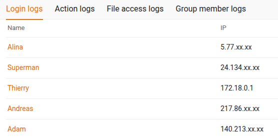

# Activate IPv6 Support for SeaTable

SeaTable supports IPv6 in general. There is no special activation required.

## Docker and IPv6

### Problem

There is one area that requires additional attention. Docker, by default, does not assign IPv6 addresses to its containers; instead, containers receive only IPv4 addresses.

Requests arriving via an IPv6 connection still reach SeaTable. However, a problem arises for services like nginx or SeaTable that log the source IP address. Every incoming IPv6 request is logged with the Docker network gateway IP address (e.g., `172.18.0.1`), not the client’s actual IPv6 address. In the following screenshot, you can see that *Thierry* connected from an IPv6 address.



You can confirm this by running `docker inspect seatable-server`:

```json
[
    {
        ...
        "Networks": {
            "frontend-net": {
                ...
                "Gateway": "172.18.0.1",
                "IPAddress": "172.18.0.5",
                "IPv6Gateway": "",
                "GlobalIPv6Address": "",
                ...
            }
        }
    }
]
```

While this does not cause immediate service disruptions, it presents some challenges:
- Incorrect client IPs are logged.
- Rate limiting or other IP-based limits may behave incorrectly.

---

### Solution

<!-- md:version 6.0 -->

The solution is straightforward. Add the following parameter to your Docker network configuration (for example, in caddy.yml):

```
networks:
  frontend-net:
    name: frontend-net
    enable_ipv6: ${ENABLE_IPV6:-true}
```

This enables IPv6 addressing for the container and ensures accurate logging of client IP addresses. **Starting with SeaTable version 6.0**, this feature is enabled by default.

---

### Setups without IPv6

!!! warning "What if IPv6 is completely diabled on your server?"

    If IPv6 is completely disabled, Docker may fail to start containers with errors such as:

    - `cannot read IPv6 setup`
    - `cannot assign requested address`
    - `failed to start container ... error="driver failed programming external connectivity`
    - `error response from daemon: attaching to network failed`

    In this case, set `ENABLE_IPV6=false` in your `.env` file to disable IPv6 support in Docker, allowing containers to start successfully.