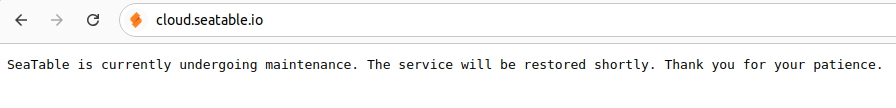

# Maintenance Mode

Sometimes updates or changes in the configuration are necessary, and it's important to limit access to the server during this period. Enabling maintenance mode ensures that only dedicated IP addresses can access the server, while all other users see a simple maintenance page with a `503 Service Unavailable` status code.

## Enabling Maintenance Mode

Here's how to configure such a maintenance page using Caddy:

1. Go to `/opt/seatable-compose/`
2. Create a new file `maintenance.yml` with the following content.
3. Replace `<your-allowed-ip>` with the IP address that should have access to your server. Multiple IP addresses can be separated by spaces.
4. Open your `.env` file and add `maintenance.yml` as the **last** entry of the variable `COMPOSE_FILE`.
5. Run `docker compose up -d`

```yaml
---
services:
  seatable-server:
    labels:
      caddy_0.@maintenance: "not remote_ip <your-allowed-ip> private_ranges"
      caddy_0.handle: "@maintenance"
      caddy_0.handle.header: "Retry-After 3600"
      caddy_0.handle.respond: '"This SeaTable Server is currently undergoing maintenance. The service will be restored shortly. Thank you for your patience." 503'
```

Docker Compose merges these labels with the labels of `seatable-server.yml`, so all other settings like the security headers stay active.

`private_ranges` ensures that components on the same host, like Collabora Online or the Python Pipeline, can still reach your SeaTable Server.

!!! warning "Use handle, not respond"

    Older versions of this article used `respond` without `handle`. With this configuration, paths that are routed to other containers (e.g. `/app-server/*` of the [HTML server](../components/html-server.md)) stayed accessible during the maintenance. `handle` blocks these paths as well. Read more in [IP Access Restriction](./ip-access-restriction.md).

## How does maintenance look like

If you are accessing your system from an IP address that has been specified in your labels, you can continue using SeaTable as usual.

All other users will see a maintenance page displaying the following message:



## Disable Maintenance Mode

To disable maintenance mode, remove `maintenance.yml` from the variable `COMPOSE_FILE` in your `.env` file. Then, run the command:

```bash
docker compose up -d
```

Your SeaTable server will once again be accessible to all users.
