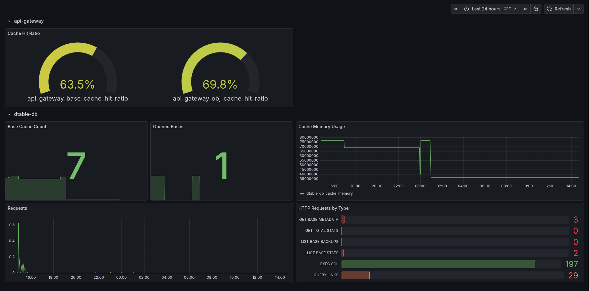

# Metrics

<!-- md:version 6.0 -->

Metrics give insight into a system's health. In addition, they allow detection of changes happening over time.
Automatic alerts (e.g. by using [Alertmanager](https://prometheus.io/docs/alerting/latest/alertmanager/)) can be configured to provide notifications in case of error conditions or incidents.

Currently, the following SeaTable components expose metrics in a [Prometheus](https://prometheus.io/)-compatible format:

- api-gateway
- dtable-db
- caddy

In addition, **Gunicorn** and **NGINX** can be configured to expose metrics in a different format. Exporters can be used to transform these into a Prometheus-compatible format.

## SeaTable Components

### api-gateway

You can enable the `/metrics` endpoint and configure the basic auth credentials by adding the following configuration block inside `/opt/seatable-server/seatable/conf/dtable-api-gateway.conf`:

```ini
[metrics]
enable_basic_auth = true
username = "<username>"
password = "<password>"
```

**Note:** SeaTable does not create the `dtable-api-gateway.conf` configuration file by default. If it does not exist yet, simply create it.

Remember to restart SeaTable by running the following command:

```bash
docker restart seatable-server
```

You can test the metrics endpoint by running the following command on the host:

```bash
curl -sS https://$SEATABLE_SERVER_HOSTNAME/api-gateway/metrics --user "<username>:<password>"
```

<details>
<summary>Example Output</summary>
  ```text
  # HELP api_gateway_base_cache_hit_ratio Total base cache hit ratio
  # TYPE api_gateway_base_cache_hit_ratio gauge
  api_gateway_base_cache_hit_ratio 0.6086956521739131
  # HELP api_gateway_base_cache_hit_total Total base cache hit number
  # TYPE api_gateway_base_cache_hit_total counter
  api_gateway_base_cache_hit_total 14
  # HELP api_gateway_base_cache_miss_total Total base cache miss number
  # TYPE api_gateway_base_cache_miss_total counter
  api_gateway_base_cache_miss_total 9
  # HELP api_gateway_obj_cache_eviction_number Total obj cache eviction number
  # TYPE api_gateway_obj_cache_eviction_number counter
  api_gateway_obj_cache_eviction_number 5
  # HELP api_gateway_obj_cache_hit_ratio Total obj cache hit ratio
  # TYPE api_gateway_obj_cache_hit_ratio gauge
  api_gateway_obj_cache_hit_ratio 0.6521739130434783
  # HELP api_gateway_obj_cache_hit_total Total obj cache hit number
  # TYPE api_gateway_obj_cache_hit_total counter
  api_gateway_obj_cache_hit_total 15
  # HELP api_gateway_obj_cache_miss_total Total obj cache miss number
  # TYPE api_gateway_obj_cache_miss_total counter
  api_gateway_obj_cache_miss_total 8
  ```
</details>

### dtable-db

You can enable the `/metrics` endpoint and configure the basic auth credentials by adding the following configuration block inside `/opt/seatable-server/seatable/conf/dtable-db.conf`:

```ini
[metrics]
enable_basic_auth = true
username = "<username>"
password = "<password>"
```

Remember to restart SeaTable by running the following command:

```bash
docker restart seatable-server
```

You can test the metrics endpoint by running the following command on the host:

```bash
docker exec seatable-server curl -sS http://localhost:7777/metrics --user "<username>:<password>"
```

**Note:** `curl` is executed inside the container since port 7777 is not exposed to the host by default.

<details>
<summary>Example Output</summary>
  ```text
  # HELP dtable_db_archive_task_count Number of currently running import tasks
  # TYPE dtable_db_archive_task_count gauge
  dtable_db_archive_task_count 0
  # HELP dtable_db_cache_base_count Number of currently cached bases
  # TYPE dtable_db_cache_base_count gauge
  dtable_db_cache_base_count 2
  # HELP dtable_db_cache_memory The memory currently used by dtable cache
  # TYPE dtable_db_cache_memory gauge
  dtable_db_cache_memory 528760
  # HELP dtable_db_in_flight_request_num The number of currently running http requests
  # TYPE dtable_db_in_flight_request_num gauge
  dtable_db_in_flight_request_num{method="GET",request="LIST ROWS"} 0
  dtable_db_in_flight_request_num{method="POST",request="sql select"} 0
  # HELP dtable_db_index_adding_count Number of currently running index adding
  # TYPE dtable_db_index_adding_count gauge
  dtable_db_index_adding_count 0
  # HELP dtable_db_is_doing_backup Is dtable db doing backup now
  # TYPE dtable_db_is_doing_backup gauge
  dtable_db_is_doing_backup 0
  # HELP dtable_db_is_doing_cleanup Is dtable db doing cleanup now
  # TYPE dtable_db_is_doing_cleanup gauge
  dtable_db_is_doing_cleanup 0
  # HELP dtable_db_opened_bases Number of opened archived bases
  # TYPE dtable_db_opened_bases gauge
  dtable_db_opened_bases 1
  # HELP dtable_db_opened_olap_bases Number of opened OLAP bases
  # TYPE dtable_db_opened_olap_bases gauge
  dtable_db_opened_olap_bases 0
  # HELP dtable_db_request_duration_seconds Total request duration
  # TYPE dtable_db_request_duration_seconds counter
  dtable_db_request_duration_seconds{method="GET",request="LIST ROWS"} 0.07200000000000001
  # HELP dtable_db_request_total Total http request count
  # TYPE dtable_db_request_total counter
  dtable_db_request_total{method="GET",request="LIST ROWS"} 3
  # HELP dtable_db_unarchive_task_count Number of currently running unarchive tasks
  # TYPE dtable_db_unarchive_task_count gauge
  dtable_db_unarchive_task_count 0
  ```
</details>

### Gunicorn

Gunicorn only supports the older **statsD** protocol to emit metrics.
[`statsd_exporter`](https://github.com/prometheus/statsd_exporter) can be used to ingest these metrics and transform them into Prometheus-compatible metrics.

You can enable this by adding the following configuration setting inside `/opt/seatable-server/seatable/conf/gunicorn.py`:

```py
statsd_host = 'statsd-exporter:9125'
```

Afterwards, Gunicorn must be restarted in order to apply the configuration changes:

```bash
docker restart seatable-server
```

You can use the following `statsd-exporter.yml` file to deploy the exporter alongside SeaTable:

```yaml
services:
  statsd-exporter:
    image: prom/statsd-exporter:v0.29.0
    container_name: statsd-exporter
    restart: unless-stopped
    command: ["--statsd.mapping-config=/tmp/statsd-exporter-config.yml"]
    networks:
      - o11y-net
    ports:
      - 127.0.0.1:9102:9102
    volumes:
      - ./statsd-exporter-config.yml:/tmp/statsd-exporter-config.yml:ro

  # Gunicorn needs to be able to access statsd-exporter
  seatable-server:
    networks:
      - o11y-net

networks:
  o11y-net:
    name: o11y-net
```

This is the corresponding configuration file for the exporter (`statsd-exporter-config.yml`) that is mounted into the container:

```yaml
defaults:
  observer_type: histogram

mappings:
  - match: gunicorn.request.status.*
    name: gunicorn_requests_total
    labels:
      status: $1
```

After adding `statsd-exporter.yml` to the `COMPOSE_FILE` variable and starting the container, the exporter will serve a metrics endpoint that contains metrics in a Prometheus-compatible format:

```bash
curl -sS 127.0.0.1:9102/metrics
```

<details>
<summary>Example Output</summary>
  ```text
  # HELP gunicorn_request_duration Metric autogenerated by statsd_exporter.
  # TYPE gunicorn_request_duration histogram
  gunicorn_request_duration_bucket{le="0.005"} 7
  gunicorn_request_duration_bucket{le="0.01"} 50
  gunicorn_request_duration_bucket{le="0.025"} 142
  gunicorn_request_duration_bucket{le="0.05"} 159
  gunicorn_request_duration_bucket{le="0.1"} 163
  gunicorn_request_duration_bucket{le="0.25"} 163
  gunicorn_request_duration_bucket{le="0.5"} 164
  gunicorn_request_duration_bucket{le="1"} 172
  gunicorn_request_duration_bucket{le="2.5"} 173
  gunicorn_request_duration_bucket{le="5"} 173
  gunicorn_request_duration_bucket{le="10"} 173
  gunicorn_request_duration_bucket{le="+Inf"} 173
  gunicorn_request_duration_sum 10.003946999999993
  gunicorn_request_duration_count 173
  # HELP gunicorn_requests Metric autogenerated by statsd_exporter.
  # TYPE gunicorn_requests counter
  gunicorn_requests 173
  # HELP gunicorn_requests_total Metric autogenerated by statsd_exporter.
  # TYPE gunicorn_requests_total counter
  gunicorn_requests_total{status="200"} 149
  gunicorn_requests_total{status="302"} 24
  # HELP gunicorn_workers Metric autogenerated by statsd_exporter.
  # TYPE gunicorn_workers gauge
  gunicorn_workers 5
  ```
</details>

### NGINX

In order to expose basic metrics regarding the number of connections and handled requests, the `ngx_http_stub_status_module` module must be enabled.
You can achieve this by adding the following configuration block at the bottom of the NGINX configuration file, which is located at `/opt/seatable-compose/config/seatable-config.conf`:

```nginx
server {
    listen 8080;

    location = /metrics {
        stub_status;
    }
}
```

Using a separate HTTP server ensures that the `/metrics` route won't be publicly accessible.

You can test the validity of your configuration file by running the following command:

```bash
docker exec -it seatable-server nginx -t
```

This should return the following output:

```text
nginx: the configuration file /etc/nginx/nginx.conf syntax is ok
nginx: configuration file /etc/nginx/nginx.conf test is successful
```

NGINX must be restarted in order to apply the configuration changes:

```bash
docker exec -it seatable-server sv restart nginx
```

[`nginx-prometheus-exporter`](https://github.com/nginx/nginx-prometheus-exporter) must be deployed alongside your SeaTable instance in order to expose these metrics in a Prometheus-compatible format.
You can use the following `nginx-exporter.yml` file to get started:

```yaml
services:
  nginx-exporter:
    image: nginx/nginx-prometheus-exporter:1.5.1
    container_name: nginx-exporter
    restart: unless-stopped
    command: ["--nginx.scrape-uri=http://seatable-server:8080/metrics"]
    networks:
      - o11y-net
    ports:
      - 127.0.0.1:9113:9113

  # nginx-exporter needs to access NGINX running inside seatable-server
  seatable-server:
    networks:
      - o11y-net

networks:
  o11y-net:
    name: o11y-net
```

Remember to add `nginx-exporter.yml` to the `COMPOSE_FILE` variable and start the exporter by running the following command:

```bash
docker compose up -d
```

You can test the metrics endpoint by running the following command on the host:

```bash
curl -sS http://127.0.0.1:9113/metrics
```

<details>
<summary>Example Output</summary>
  ```text
  # HELP nginx_connections_accepted Accepted client connections
  # TYPE nginx_connections_accepted counter
  nginx_connections_accepted 8
  # HELP nginx_connections_active Active client connections
  # TYPE nginx_connections_active gauge
  nginx_connections_active 7
  # HELP nginx_connections_handled Handled client connections
  # TYPE nginx_connections_handled counter
  nginx_connections_handled 8
  # HELP nginx_connections_reading Connections where NGINX is reading the request header
  # TYPE nginx_connections_reading gauge
  nginx_connections_reading 0
  # HELP nginx_connections_waiting Idle client connections
  # TYPE nginx_connections_waiting gauge
  nginx_connections_waiting 6
  # HELP nginx_connections_writing Connections where NGINX is writing the response back to the client
  # TYPE nginx_connections_writing gauge
  nginx_connections_writing 1
  # HELP nginx_exporter_build_info A metric with a constant '1' value labeled by version, revision, branch, goversion from which nginx_exporter was built, and the goos and goarch for the build.
  # TYPE nginx_exporter_build_info gauge
  nginx_exporter_build_info{branch="main",goarch="amd64",goos="linux",goversion="go1.25.3",revision="bae43bc818cd6e47a08163a7b31f355f454e9ecb",tags="unknown",version="0.0.0-SNAPSHOT-bae43bc"} 1
  # HELP nginx_http_requests_total Total http requests
  # TYPE nginx_http_requests_total counter
  nginx_http_requests_total 153
  # HELP nginx_up Status of the last metric scrape
  # TYPE nginx_up gauge
  nginx_up 1
  ```
</details>

### Caddy

[Caddy](https://caddyserver.com/) natively supports exposing metrics in a Prometheus-compatible format. Since SeaTable uses [caddy-docker-proxy](https://github.com/lucaslorentz/caddy-docker-proxy), metrics can be enabled by adding Docker labels to the Caddy service.

Create a `caddy-metrics.yml` file in your `/opt/seatable-compose` directory:

```yaml
services:
  caddy:
    labels:
      caddy_0.metrics:
      caddy_0.metrics.per_host:
      caddy_1: ":2020"
      caddy_1.metrics: /metrics
    ports:
      - 127.0.0.1:2020:2020
    networks:
      - o11y-net

networks:
  o11y-net:
    name: o11y-net
```

These labels configure Caddy to collect per-host metrics and expose them on a dedicated, read-only endpoint on port 2020 (separate from the Caddy Admin API on port 2019).

Add `caddy-metrics.yml` to the `COMPOSE_FILE` variable in your `.env` file and restart the containers:

```bash
docker compose up -d
```

You can test the metrics endpoint by running the following command on the host:

```bash
curl -sS http://127.0.0.1:2020/metrics
```

## Scraping

There are many ways to ingest the metrics into Prometheus.

### Grafana Alloy

You can use [Grafana Alloy](https://grafana.com/docs/alloy/latest/) to scrape metrics from SeaTable components and forward them to an existing [Prometheus server](https://prometheus.io/) using Prometheus' [remote-write](https://grafana.com/docs/alloy/latest/reference/components/prometheus/prometheus.remote_write/) functionality.

The following YAML manifest can serve as a starting point to deploy Alloy:

```yaml
services:
  alloy:
    image: grafana/alloy:v1.12.0
    container_name: alloy
    restart: unless-stopped
    environment:
      - PROMETHEUS_URL=${PROMETHEUS_URL:?Variable is not set or empty}
      - PROMETHEUS_USERNAME=${PROMETHEUS_USERNAME:?Variable is not set or empty}
      - PROMETHEUS_PASSWORD=${PROMETHEUS_PASSWORD:?Variable is not set or empty}
      - SEATABLE_METRICS_USERNAME=${SEATABLE_METRICS_USERNAME:?Variable is not set or empty}
      - SEATABLE_METRICS_PASSWORD=${SEATABLE_METRICS_PASSWORD:?Variable is not set or empty}
    networks:
      - o11y-net
    volumes:
      - ./config.alloy:/etc/alloy/config.alloy:ro
      - /opt/alloy-data:/var/lib/alloy/data
    command:
      - run
      - --server.http.listen-addr=0.0.0.0:12345
      - --storage.path=/var/lib/alloy/data
      - /etc/alloy/config.alloy

  # Attach seatable-server container to o11y-net
  # This allows Alloy to scrape metrics
  seatable-server:
    networks:
      - o11y-net

networks:
  o11y-net:
    name: o11y-net
```

The following `config.alloy` config file should be created inside the same directory:

```alloy
prometheus.remote_write "default" {
  endpoint {
    url = env("PROMETHEUS_URL")
    basic_auth {
      username = env("PROMETHEUS_USERNAME")
      password = env("PROMETHEUS_PASSWORD")
    }
  }
}

prometheus.scrape "seatable_metrics" {
  targets = [
    {"__address__" = "seatable-server:7780", "instance" = "api-gateway"},
    {"__address__" = "seatable-server:7777", "instance" = "dtable-db"},
    {"__address__" = "statsd-exporter:9102", "instance" = "gunicorn"},
    {"__address__" = "nginx-exporter:9113", "instance" = "nginx"},
  ]

  basic_auth {
    username = env("SEATABLE_METRICS_USERNAME")
    password = env("SEATABLE_METRICS_PASSWORD")
  }

  forward_to = [prometheus.remote_write.default.receiver]
  scrape_interval = "15s"
}

// Caddy metrics do not use basic authentication and
// therefore require a separate scrape configuration.
prometheus.scrape "caddy_metrics" {
  targets = [
    {"__address__" = "caddy:2020", "instance" = "caddy"},
  ]

  forward_to = [prometheus.remote_write.default.receiver]
  scrape_interval = "15s"
}
```

## Grafana Dashboard

We have published a [Grafana dashboard](https://grafana.com/grafana/dashboards/24942-seatable-dashboard/) that displays these metrics.
You can import this dashboard into your Grafana instance by specifying its ID (`24942`).


