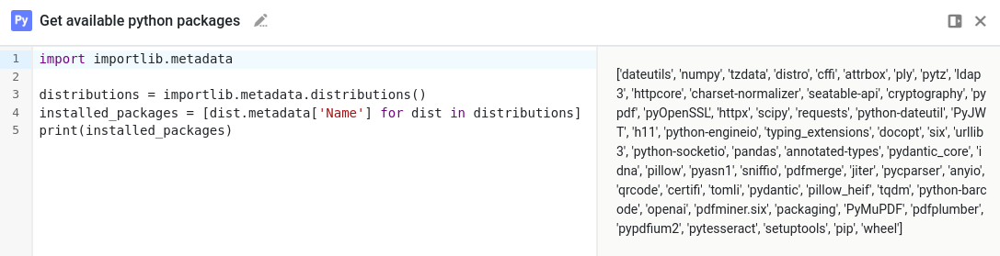

# Create your own SeaTable Python Runner

The SeaTable Python Pipeline includes a pre-configured python-runner image with numerous third-party Python libraries to execute your scripts. For a complete list of the included libraries, refer to the [Developer Manual](https://developer.seatable.com/scripts/python/common_questions/#install-and-use-custom-python-libraries).

If you require additional Python packages, you can either contact support to request their inclusion in future versions or build your own custom image by extending the existing one.

## Build your own custom python runner image

This guide assumes you will create the custom Python runner image directly on your server. If you choose to build it locally, you must push the custom image to an image registry (e.g., Docker Hub), which is outside the scope of this guide.

### Step 1: Create a `Dockerfile`:

Create a `Dockerfile` with the following content:

```Dockerfile
# You can find the latest tag here: https://hub.docker.com/r/seatable/seatable-python-runner/tags
# or simply use the "latest" tag.
FROM seatable/seatable-python-runner:latest

# Install your custom-packages with pip
RUN pip install --user --no-cache-dir \
  pypdf \
  pytesseract \
  # Replace with your required packages
```

### Step 2: Build your Image

Run the following command to build your image. Use the `-t` option to specify a custom name and tag:

```bash
docker build . -t custom-python-runner:1.0
```

### Step 3: Configure SeaTable to Use Your Custom Image

Update your `/opt/seatable-compose/.env` file to specify your custom Python runner image:

```ini
PYTHON_RUNNER_IMAGE='custom-python-runner:1.0'
```

After updating the .env file, restart your SeaTable setup with:

```
docker compose up -d
```

You can verify that your custom image is being used by running:

```
docker ps
```

### Step 4: Verify Installed Packages

Run this Python script within SeaTable to confirm that your required packages are available:

```
import importlib.metadata

distributions = importlib.metadata.distributions()
installed_packages = [dist.metadata['Name'] for dist in distributions]
print(installed_packages)
```

This script will display a list of installed Python packages.



## Important Considerations

!!! warning "No Automatic Updates"

    By creating a custom Python runner image, you forgo automatic updates. When a new base image version is released, manually rebuild your custom image to incorporate the latest changes.

!!! warning "Footprint"

    While installing additional Python packages won't significantly slow down your Python Docker Runner, it will:
    
    - Increase the container's size
    - Potentially increase memory usage

    These factors may affect deployment time and resource allocation, but usually won't impact runtime performance noticeably.