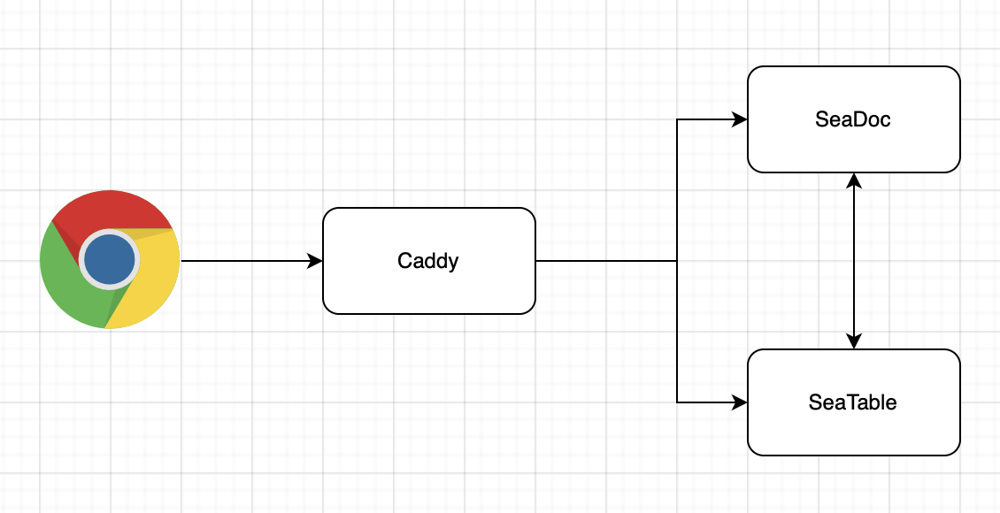

# SeaDoc Integration

SeaDoc is an extension of SeaTable that providing an online collaborative document editor.

SeaDoc designed around the following key ideas:

* An expressive easy to use editor
* A review and approval workflow to better control how contents changes
* Inter-document linking for connecting related contents
* AI integration that streamlines content generation, summarization, and management
* Comprehensive APIs for automating document generating and processing

SeaDoc excels at:

* Authoring product and technical documents
* Creating knowledge base articles and online manuals
* Building internal Wikis

## Architecture

The SeaDoc archticture is demonstrated as below:



Here is the workflow when a user open a seadoc in browser

1. When a user open a seadoc in the browser, a file loading request will be sent to Caddy, and Caddy proxy the request to SeaDoc server.
2. SeaDoc server will send the file's content back if it is already cached, otherwise SeaDoc serve will sends a request to SeaTable server.
3. SeaTable server loads the content, then sends it to SeaDoc server and write it to the cache at the same time.
4. After SeaDoc receives the content, it will be sent to the browser.

## Deployment SeaDoc

The easiest way to deployment SeaDoc is to deploy it with SeaTable server on the same host using the same Docker network. If in some situations, you need to deployment SeaDoc standalone, you can follow the next section.

NOTE: Deploy SeaDoc requires SeaTable 5.3.

### Change the .env file

To install SeaDoc, include `seadoc.yml` in the `COMPOSE_FILE` variable within your `.env` file. This instructs Docker to download the required images for SeaDoc.

Simply copy and paste (:material-content-copy:) the following code into your command line:

```bash
sed -i "s/COMPOSE_FILE='\(.*\)'/COMPOSE_FILE='\1,seadoc.yml'/" /opt/seatable-compose/.env
```

### Add SeaDoc configurations to .env file

```env
ENABLE_SEADOC=true
```

### Download SeaDoc and restart

One more step is necessary to download the SeaDoc image and restart the SeaTable service.

```bash
cd /opt/seatable-compose
docker compose up -d
```

Wait some minutes until SeaDoc finished initializing.

Now SeaDoc can be used.

## Deploy SeaDoc standalone

The deployment of a separate SeaDoc is simple. Get seatable-release from github like described in the installation of seatable server and only use `seadoc-standalone.yml` and `caddy.yml`.

Update your `.env`, that it looks like this and add/update the values according to your needs:

```env
COMPOSE_FILE='caddy.yml,seadoc-standalone.yml'
COMPOSE_PATH_SEPARATOR=','

# system settings
TIME_ZONE='Europe/Berlin'

# seatable server url
SEATABLE_SERVER_HOSTNAME=seatable.your-url.com
SEATABLE_SERVER_PROTOCOL=http

# database
SEATABLE_MYSQL_DB_HOST=
SEATABLE_MYSQL_ROOT_PASSWORD=

# SeaDoc
JWT_PRIVATE_KEY=
SEADOC_SERVER_HOSTNAME=seadoc.your-url.com
SEADOC_SERVER_PROTOCOL=http
```

Note: `JWT_PRIVATE_KEY`, same as the `JWT_PRIVATE_KEY` field in SeaTable `.env` file.

Execute `docker compose up -d` to fire up your separate SeaDoc.

### Configurations of SeaTable Server

SeaTable must know where to get the SeaDoc.

Update the `.env` on the seatable server and add these two information:

```env
ENABLE_SEADOC=true
SEADOC_SERVER_URL='http://seadoc.example.com/'
```

Restart seatable service and test your SeaDoc.

## SeaDoc directory structure

`/opt/seadoc-data`

Placeholder spot for shared volumes. You may elect to store certain persistent information outside of a container, in our case we keep various log files outside. This allows you to rebuild containers easily without losing important information.

* /opt/seadoc-data/logs: This is the directory for SeaDoc logs.

## Database used by SeaDoc

SeaDoc used one database table `dtable_db.sdoc_operation_log` to store operation logs.
