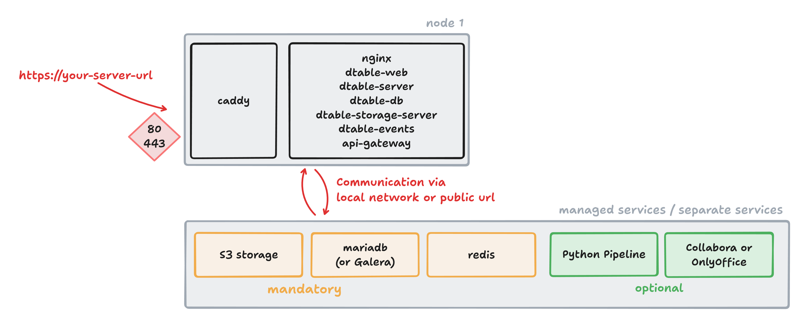

# Basic Setup of a SeaTable Cluster

SeaTable currently does not support installing a cluster with a single command. This may change in the future, but for now, some configuration changes and migrations are required after deploying the Docker containers.

Every SeaTable Cluster installation starts with the deployment of a single node. The main difference is that, from the beginning, you use external services instead of running Redis and MariaDB on the same machine as SeaTable.
Arterwards we will move component after component to other nodes.



## Basic setup with external services

Follow the [installation instructions for a single node](../basic-setup.md) up to the point where you would start your SeaTable Server for the first time. Before starting the server, you need to make some additional changes to your setup.

??? success "Use external services instead of local MariaDB and Redis"

    Update your `.env` file to include the required variables for `REDIS` and `MARIADB`. Set passwords, IPs, and usernames according to your environment. This ensures that your SeaTable Server connects to these external services.

    ```
    # components to be used; IMPORTANT: there should be no space between
    # the files names!
    COMPOSE_FILE='caddy.yml,dtable-web.yml'
    COMPOSE_PATH_SEPARATOR=','

    # system settings
    TIME_ZONE='Europe/Berlin'

    # seatable server url
    SEATABLE_SERVER_HOSTNAME='cluster.seatable.com
    SEATABLE_SERVER_PROTOCOL='https'

    # initial web admin
    SEATABLE_ADMIN_EMAIL='cluster@seatable.com'
    SEATABLE_ADMIN_PASSWORD='topsecret'

    # database (managed service)
    MARIADB_HOST=10.0.0.99
    MARIADB_USER=root
    MARIADB_PASSWORD='topsecret'

    # redis (managed service)
    REDIS_HOST=10.0.0.99
    REDIS_PORT=6379
    REDIS_PASSWORD='topsecret'

    # shared secret for secure communication
    JWT_PRIVATE_KEY='topsecret'
    ```

??? success "Remove Redis and Mariadb from your YAML file."

    Create a copy of `seatable-server.yml` and name it, for example, `dtable-web.yml`. Make the following changes to this file:

    - Remove the `depends_on:` entries for Redis and MariaDB.
    - Remove the `backend-seatable-net` network, as it is no longer needed.

    Example configuration:

    ```
    ---
    services:
      seatable-server:
        image: ${SEATABLE_IMAGE:-seatable/seatable-enterprise:x.x.x}
        restart: unless-stopped
        container_name: seatable-server
        volumes:
            ...
        environment:
            ...
        labels:
            ...
        networks:
          - frontend-net

    networks:
      frontend-net:
        name: frontend-net
    ```

Now, you can run `docker compose up -d` for the first time.

After starting, verify that only these two Docker containers are running on the SeaTable node:

- caddy
- seatable-server

Log in with your defined admin credentials for the first time to check, that the deployment was successful.

## Migration to S3 storage

Follow the instructions in the admin manual to [migrate from local storage to S3](../advanced/s3-migration.md) for the following data types:

- Base snapshots
- Files and pictures
- Avatars

Verify that everything is working by performing these steps:

- Create a new base. After a few minutes, you should see the `current` directory in the S3 bucket for storage.
- Create a new file/image column in the base and upload a file. You should see new entries in the S3 buckets for `fs`, `commits`, and `blocks`.
- Upload a new avatar. This should be stored in the S3 bucket for `avatars`.

Once you have verified that everything is working, you can continue with the deployment.
