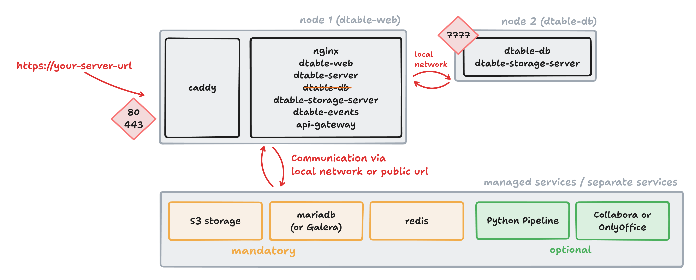

# dtable-db Standalone

To improve scalability and reliability, the next step is to move `dtable-db` to its own dedicated node.



## Setting Up a Standalone dtable-db Server

Prepare a new node with Docker installed, and copy the following files from your first node to this new node:

- `/opt/seatable-compose/.env`
- `/opt/seatable-compose/seatable-license.txt`

Open the `.env` file on the new node and ensure that the `COMPOSE_FILE` variable references only a single YAML file, like this:

```
COMPOSE_FILE='dtable-db.yml'
```

### Create `dtable-db.yml`

Now, create the `dtable-db.yml` file. You can either copy `seatable-cluster.yml` from the first node or use `seatable-server.yml` from the SeaTable release as a template.

Apply the following required changes to this file:

??? success "Remove all services except seatable-server"

    The dtable-db node only requires the `seatable-server` service. Remove all other services (such as redis, mariadb, or caddy).

??? success "Remove all labels"

    Since dtable-db does not require Caddy or any TLS termination, remove all labels from the `seatable-server` service.

??? success "Add additional environment variables"

    Add or update the following environment variables to ensure only dtable-db is enabled:

    ```
    environment:
      #... all default environment variables in seatable-server.yml ...
      # this node should only run dtable-db, all other services are disabled
      - ENABLE_DTABLE_DB=true                # that is, what we want
      - ENABLE_DTABLE_STORAGE_SERVER=true    # required for big data backup
      - ENABLE_SEAFILE_SERVER=false
      - ENABLE_DTABLE_WEB=false
      - ENABLE_DTABLE_SERVER=false
      - ENABLE_DTABLE_EVENTS=false
      - ENABLE_API_GATEWAY=false
      - SEATABLE_START_MODE=cluster          # Don't run any database update processes
    ```

??? success "Expose port 7777"

    The dtable-db node must be accessible to other nodes. Add the following to the `seatable-server` service:

    ```
    ports:
      - 7777:7777
    ```

??? success "Configure internal network communication"

    Node-to-node communication uses the internal network. Ensure all nodes can reach each other by adding their names and private IP addresses:

    ```
    extra_hosts:
      - "seatable-n1:10.0.0.2"
      - "seatable-n2:10.0.0.4"
    ```

For reference, here is an example of what your `dtable-db.yml` might look like (do not copy and paste directly — adapt as needed):

```
---
services:
  seatable-server:
    image: ${SEATABLE_IMAGE:-seatable/seatable-enterprise:x.x.x}
    restart: unless-stopped
    container_name: seatable-server
    volumes:
      - "/opt/seatable-server:/shared"
      - type: bind
        source: "./seatable-license.txt"
        target: "/shared/seatable/seatable-license.txt"
        read_only: ${SEATABLE_LICENSE_FORCE_READ_ONLY:-false}
    environment:
      ...
      ...
      # this node should only run dtable-db
      - ENABLE_DTABLE_DB=true
      - ENABLE_DTABLE_STORAGE_SERVER=true
      - ENABLE_SEAFILE_SERVER=false
      - ENABLE_DTABLE_WEB=false
      - ENABLE_DTABLE_SERVER=false
      - ENABLE_DTABLE_EVENTS=false
      - ENABLE_API_GATEWAY=false
      - SEATABLE_START_MODE=cluster
    ports:
      - 7777:7777
    extra_hosts:
      - "seatable-n1:10.0.0.2"
      - "seatable-n2:10.0.0.4"
    networks:
      - frontend-net
networks:
  frontend-net:
    name: frontend-net
```

Now, start dtable-db for the first time and monitor the logs:

```
docker compose up -d
```

### Verify installation

To verify that dtable-db is running and port 7777 is exposed, run:

```
curl 127.0.0.1:7777/ping/
```

You should receive the following response:

```
{"ret":"pong"}
```

---

## ... switch utilization to new dtable-db


### Änderung 1

Use .env to disable dtable-db from node 1.

### Änderung 2

Add `INNER_DTABLE_DB_URL` to dtable_web_settings.py

```
INNER_DTABLE_DB_URL = 'http://seatable-n2:7777/'   # or use internal ip of dtable-db node
# brauche ich DTABLE_DB_URL? wahrscheinlich nicht https://url/dtable-db/
```

and "dtable_db_service_url": "http://seatable-n2:7777" to dtable_server_config.json

### Änderung 3

Rename dtable-db.conf to dtable-db.conf-obsolete


### Restart dtable-web server

```sh
docker compose up -d

```

---

## Verify complete setup 

open a universal app in the webinterface. see log entries on second node.

TODO: add environment variables to  http://localhost:8000/configuration/environment-variables/