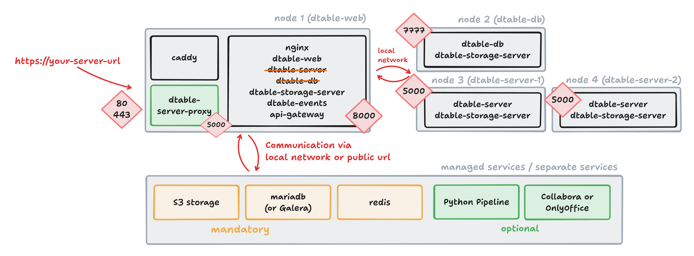

# Installation multiple dtable-servers

As your system grows, the `dtable-server` often becomes the first bottleneck. To address this, you can **scale dtable-server horizontally**. This guide explains how to set up multiple dtable-servers and configure a proxy on the `dtable-web` node to distribute base requests between them.



## Routing logic with multiple dtable-servers

Proper routing logic is essential when running multiple dtable-servers. While `seatable-server` itself is stateless, it is **crucial that all users open a specific base on the same dtable-server**. 

- When a base is opened, dtable-server loads it into memory and only writes updates to disk every five minutes.
- If the same base is opened on two different dtable-servers, their changes can overwrite each other — this must be avoided.

To ensure consistency, implement a **fixed mapping of bases to dtable-servers** using the `base_uuid`. This ensures each base is always handled by the same server. This setup is not a failover solution, but it scales horizontally and can support thousands or even tens of thousands of users.

**Example mapping logic:**

- Bases starting with `0-9`: handled by the first dtable-server.
- Bases starting with `a-f`: handled by the second dtable-server.

## Setting up a of second dtable-server

1. **Install a second dtable-server** as described in the [dtable-server (standalone)](dtable-db-standalone.md) section. Name it `dtable-server-2`.

2. **Update the private network configuration**: Add the IP address of the new server to the `extra_hosts` section on all nodes.

    ```
      extra_hosts:
        - "dtable-web:10.0.0.2"
        - "dtable-db:10.0.0.3"
        - "dtable-server:10.0.0.4"
        - "dtable-server-2:10.0.0.5
    ```

3. **Verify** that `dtable-server-2` is accessible on port 5000.

## Adding a Proxy to Distribute Requests

To route requests to the correct `dtable-server`, add a **proxy component** (using nginx), called `dtable-server-proxy`. Deploy this on the `dtable-web` node.

### Create the Proxy Service

Create `/opt/seatable-compose/dtable-server-proxy.yml` on `dtable-web`:

```
---
services:
  dtable-server-proxy:
    image: nginx:1.27.5-alpine
    container_name: dtable-server-proxy
    ports:
      - "5000:5000"
    volumes:
      - ./nginx-proxy.conf:/etc/nginx/nginx.conf:ro
    networks:
      - frontend-net
    extra_hosts:
      - "dtable-web:10.0.0.2"
      - "dtable-db:10.0.0.3"
      - "dtable-server:10.0.0.4"
      - "dtable-server-2:10.0.0.5
    logging:
      driver: json-file
      options:
        # Maximum size per file
        max-size: 10m
        # Maximum number of files
        max-file: 3

networks:
  frontend-net:
    name: frontend-net
```

### Configure nginx Routing

Create `/opt/seatable-compose/nginx-proxy.conf` on `dtable-web`. This configuration defines two upstream servers and a routing map:

```
worker_processes auto;

events {
  worker_connections 4096;
}

http {
  access_log off;
  error_log /dev/stdout warn;

  # dtable-server 1
  upstream dtable_server_a_z {
    server dtable-server:5000;
    keepalive 15;
  }

  # dtable-server 2
  upstream dtable_server_0_9 {
    server dtable-server-2:5000;
    keepalive 15;
  }

  # Map to dynamically determine the upstream server based on the UUID in the URL
  map $request_uri $dtable_upstream {
    default                                  dtable_server_a_z;    # Default to the a-z server
    "~*ff84e1a1-66e2"                        dtable_server_0_9;    # force this base to server 2
    "~*([a-zA-Z])([0-9a-f]{7}-[0-9a-f]{4})"  dtable_server_a_z;
    "~*([0-9])([0-9a-f]{7}-[0-9a-f]{4})"     dtable_server_0_9;
  }

server {
  server_name _;
  listen 5000;

  location / {
    proxy_pass http://$dtable_upstream;
    proxy_set_header X-Upstream-Server $dtable_upstream;
    client_max_body_size 100m;
    proxy_http_version 1.1;
    proxy_set_header Upgrade $http_upgrade;
    proxy_set_header Connection upgrade;
    access_log /tmp/access.log;
    error_log /tmp/error.log;
  }
}
}
```

You can adapt the routing logic as needed, for example by splitting bases differently or forcing specific `base_uuid`s to a particular server.

## Required Configuration Changes

??? success "Start dtable-server-proxy"

    Add `dtable-server-proxy.yml` to your `.env` by including it in the `COMPOSE_FILE` variable. This ensures the proxy container starts.

??? success "Allow direct access to dtable-web"

    Edit `conf/gunicorn.py` and update the bind address:

    ```
    bind = '0.0.0.0:8000'
    ```

??? success "Update INNER_DTABLE_SERVER"

    Edit `conf/dtable_web_settings.py` and set:

    ```
    INNER_DTABLE_SERVER = 'http://dtable-web:5000/'
    ```

??? success "Update Ping endpoints"

    Edit `/opt/seatable-compose/config/seatable-nginx.conf` to update ping endpoints:

    ```
    # ping endpoints
    location = /dtable-server/ping/ {
        proxy_pass http://dtable-web:5000/ping/;
    }
    location = /dtable-db/ping/ {
        proxy_pass http://dtable-db:7777/ping/;
    }
    ```

Restart all containers on `dtable-web` to apply the changes.

### Updates on dtable-db

Since the routing logic has changed, update `dtable-db` so it always uses the proxy instead of contacting `dtable-server` directly.

??? success "Use dtable-server-proxy on dtable-db"

    Edit `conf/dtable-db` and set:

    ```
    [dtable cache]
    dtable_server_url = "http://dtable-web:5000"
    ```

### Unload all bases on dtable-servers

To ensure no bases remain in memory on the dtable-servers, **restart both servers**. This prevents issues with parallel saving of bases.

!!! danger "Unloading is crucial"

    Any time you modify the proxy logic in your nginx configuration, you must restart all dtable-servers. Since `dtable-server` can keep bases in memory for up to 24 hours, failing to restart may result in data loss or inconsistencies.

## Verify your setup

Use the following tests to confirm your configuration:

| Where to execute | Test | Expected result |
| --- | --- | --- |
| dtable-web | `curl http://127.0.0.1:5000/ping/` | pong |
| dtable-web | `curl http://127.0.0.1:8000/api2/ping/` | pong |
| Browser | Open a base with `base_uuid` starting a-z | Log entries on `dtable-server` |
| Browser | Open a base with `base_uuid` starting 0-9 | Log entries on `dtable-server-2` |
| Browser | Open a universal app | Log entries on `dtable-db` |

## Final thoughts

Congratulations! Your setup now uses two dtable-servers, laying the foundation for even greater scalability. To add additional dtable-servers, repeat these steps:

- Set up another dtable-server.
- Add the new upstream to `nginx.conf` (dtable-server-proxy).
- Restart all dtable-servers to clear their memory.