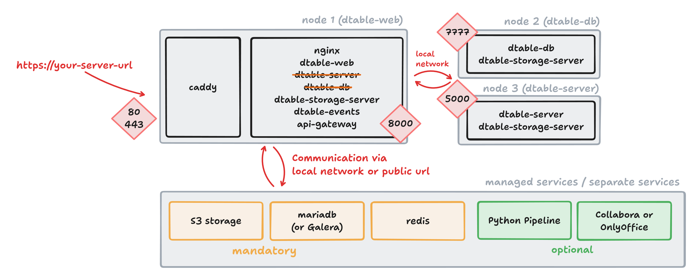

# Installation dtable-server as a standalone node

The next step in building your SeaTable cluster is to move the `dtable-server` to a separate node.



## Setting up a standalone dtable-server

Prepare a new node with Docker installed, and copy the following files from one of your existing nodes to the new node:

- `/opt/seatable-compose/.env`
- `/opt/seatable-compose/seatable-license.txt`

Edit the `.env` file on the new node and ensure the `COMPOSE_FILE` variable references only a single YAML file:

```
COMPOSE_FILE='seatable-server-standalone.yml'
```

Copy `seatable-server.yml` to `seatable-server-standalone.yml` and make the following changes to configure it as a standalone `dtable-server`.

### Required changes to `seatable-server-standalone.yml`

Apply the following required changes to this file:

??? success "Remove all services except seatable-server"

    The standalone node only requires the `seatable-server` service. Remove all other services (such as redis, mariadb, or caddy).

??? success "Add additional environment variables"

    Add or update the following environment variables to ensure only the `dtable-server` is enabled:

    ```
    environment:
      #... all default environment variables in seatable-server.yml ...
      # this node should only run dtable-server, all other services are disabled
      - ENABLE_DTABLE_DB=false
      - ENABLE_DTABLE_STORAGE_SERVER=true
      - ENABLE_SEAFILE_SERVER=false
      - ENABLE_DTABLE_WEB=false
      - ENABLE_DTABLE_SERVER=true
      - ENABLE_DTABLE_EVENTS=false
      - ENABLE_API_GATEWAY=false
      - SEATABLE_START_MODE=cluster
    ```

??? success "Expose port 5000"

    The `dtable-server` node must be accessible to other nodes. Add the following to the `seatable-server` service:

    ```
    ports:
      - 5000:5000
    ```

??? success "Configure internal network communication"

    Node-to-node communication uses the internal network. Ensure all nodes can reach each other by adding their names and private IP addresses:

    ```
    extra_hosts:
      - "dtable-web:10.0.0.2"
      - "dtable-db:10.0.0.3"
      - "dtable-server:10.0.0.4"
    ```

### Example: `dtable-server-standalone.yml`

For reference, here is an example of what your `dtable-server-standalone.yml` might look like. Do not copy and paste directly — adapt to your environment as needed.

```
---
services:
  seatable-server:
    image: ${SEATABLE_IMAGE:-seatable/seatable-enterprise:x.x.x}
    restart: unless-stopped
    container_name: seatable-server
    volumes:
      - "/opt/seatable-server:/shared"
      - type: bind
        source: "./seatable-license.txt"
        target: "/shared/seatable/seatable-license.txt"
        read_only: ${SEATABLE_LICENSE_FORCE_READ_ONLY:-false}
    environment:
      ...
      ...
      # this node should only run dtable-server
      - ENABLE_DTABLE_DB=false
      - ENABLE_DTABLE_STORAGE_SERVER=true
      - ENABLE_SEAFILE_SERVER=false
      - ENABLE_DTABLE_WEB=false
      - ENABLE_DTABLE_SERVER=true
      - ENABLE_DTABLE_EVENTS=false
      - ENABLE_API_GATEWAY=false
      - SEATABLE_START_MODE=cluster
    ports:
      - 5000:5000
    extra_hosts:
      - "dtable-web:10.0.0.2"
      - "dtable-db:10.0.0.3"
      - "dtable-server:10.0.0.4"
    networks:
      - frontend-net
networks:
  frontend-net:
    name: frontend-net
```

Now, start `dtable-db` for the first time and monitor the logs:

```
docker compose up -d
```

## Changes after first start

After the first start of `dtable-server`, make the following changes to the newly created configuration files:

??? success "Add S3 configuration"

    Add the S3 configuration to `conf/dtable-storage-server.conf`, analogous to your first or second node.

??? success "Additional configuration changes"

    Open `conf/dtable_server_config.json` and add these entries:

    ```
    {
        "dtable_db_service_url": "http://dtable-db:7777",
        "dtable_web_service_url": "http://dtable-web:8000" 
    }
    ```

Now it is time to restart dtable-server and verify that the service is running, port 5000 is exposed and a `pong` is returned:

```
curl 127.0.0.1:5000/ping/
```

## Configure dtable-web to use the standalone dtable-server

Now that `dtable-server` is running on a separate node, update `dtable-web` to use this node instead of the internal component.

??? success "Disable dtable-server in dtable-web"

    Open `/opt/seatable-compose/dtable-web.yml` and make these changes:

    ```
    environment:
      - ENABLE_DTABLE_SERVER=false
    extra_hosts:
      - "dtable-web:10.0.0.2"
      - "dtable-db:10.0.0.3"
      - "dtable-server:10.0.0.4"
    ports:
      - "8000:8000"
    ```


??? success "Update API-Gateway"

    Open the configuration file `conf/dtable-api-gateway.conf` and add these lines to specify the location of `dtable-server`:

    ```
    [dtable-server]
    server_address = "http://dtable-server:5000"
    ```

??? success "Update `dtable_web_settings.py`"

    Open `/conf/dtable_web_settings.py` and add:

    ```
    INNER_DTABLE_SERVER_URL = 'http://dtable-server:5000/'
    ```

## Additional changes on dtable-db

Specify the location of `dtable-server` in `dtable-db` as well.

??? success "Update `dtable-db.conf`"

     Find the relevant section and update the value:

    ```
    [dtable cache]
    dtable_server_url = "http://dtable-server:5000"
    ```

## Restart SeaTable on all three nodes

```sh
docker compose up -d
```

## Verify complete setup 

Open any base in your web browser and check that logs are being created on the `dtable-server` node.

Congratulations! You are now running a separate `dtable-server` and have completed the next step in building your SeaTable cluster.