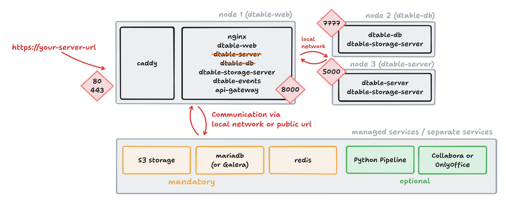

# Installation dtable-server as a standalone node

The next step in building your SeaTable cluster is to move the `dtable-server` to a separate node.



## Setting up a standalone dtable-server

Prepare a new node with Docker installed, and create a new directory for the configuration files:

```bash
mkdir -p /opt/seatable-compose
cd /opt/seatable-compose
```

You will need to create two files on this new node: `.env` and `dtable-server.yml`.

### Create `.env`

Create a `.env` file and populate it with the following content. Make sure to replace the placeholder values with the actual values from your cluster environment:

```env
COMPOSE_FILE='dtable-server.yml'
COMPOSE_PATH_SEPARATOR=','

DTABLE_SERVER_IMAGE=seatable/dtable-server-js:7.0.0-testing
TIME_ZONE='Europe/Berlin'

MARIADB_HOST=172.16.0.2
MARIADB_PORT=3306
MARIADB_USER=seatable
MARIADB_PASSWORD=seatable_password

REDIS_HOST=172.16.0.3
REDIS_PORT=6379
REDIS_PASSWORD=

JWT_PRIVATE_KEY=
```

### Create `dtable-server.yml`

Next, create the `dtable-server.yml` file to configure the standalone `dtable-server` instance. Node-to-node communication uses the internal network, so ensure you update `extra_hosts` with the correct IPs of your other cluster nodes if you use hostnames to connect.

```yaml
---
services:
  dtable-server:
    image: ${DTABLE_SERVER_IMAGE:-seatable/dtable-server-js:7.0.0-testing}
    restart: unless-stopped
    container_name: dtable-server
    volumes:
      - "/opt/seatable-server:/shared"
    ports:
      - "5000:5000"
    environment:
      - TIME_ZONE=${TIME_ZONE}
      - SEATABLE_MYSQL_DB_HOST=${MARIADB_HOST:-mariadb}
      - SEATABLE_MYSQL_DB_PORT=${MARIADB_PORT:-3306}
      - SEATABLE_MYSQL_DB_USER=root
      - SEATABLE_MYSQL_DB_PASSWORD=${MARIADB_PASSWORD:?Variable is not set or empty}
      - SEATABLE_MYSQL_DB_DTABLE_DB_NAME=dtable_db
      - REDIS_HOST=${REDIS_HOST:-redis}
      - REDIS_PORT=${REDIS_PORT:-6379}
      - REDIS_PASSWORD=${REDIS_PASSWORD:-}
      - JWT_PRIVATE_KEY=${JWT_PRIVATE_KEY:?Variable is not set or empty}
      - DTABLE_SERVER_CLUSTER_NODE_ID=${DTABLE_SERVER_CLUSTER_NODE_ID:-}
      - DTABLE_SERVER_CLUSTER_LOCAL_NODE_URL=${DTABLE_SERVER_CLUSTER_LOCAL_NODE_URL:-}
    extra_hosts:
      - "dtable-web:10.0.0.2"
      - "dtable-db:10.0.0.3"
```

Now, start `dtable-server` for the first time and monitor the logs:

```bash
docker compose up -d
```

## Changes after first start

After the first start of `dtable-server`, make the following changes to the newly created configuration files:

??? success "Add S3 configuration"

    Add the S3 configuration to `conf/dtable-storage-server.conf`, analogous to your first or second node.

??? success "Additional configuration changes"

    Open `conf/dtable_server_config.json` and add these entries:

    ```json
    {
        "dtable_db_service_url": "http://dtable-db:7777",
        "dtable_web_service_url": "http://dtable-web:8000" 
    }
    ```

Now it is time to restart dtable-server and verify that the service is running, port 5000 is exposed and a `pong` is returned:

```bash
curl 127.0.0.1:5000/ping/
```

## Configure dtable-web to use the standalone dtable-server

Now that `dtable-server` is running on a separate node, update `dtable-web` to use this node instead of the internal component.

??? success "Disable dtable-server in dtable-web"

    Open `/opt/seatable-compose/dtable-web.yml` and make these changes:

    ```yaml
    environment:
      - ENABLE_DTABLE_SERVER=false
    extra_hosts:
      - "dtable-web:10.0.0.2"
      - "dtable-db:10.0.0.3"
      - "dtable-server:10.0.0.4"
    ports:
      - "8000:8000"
    ```

??? success "Update API-Gateway"

    Open the configuration file `conf/dtable-api-gateway.conf` and add these lines to specify the location of `dtable-server`:

    ```ini
    [dtable-server]
    server_address = "http://dtable-server:5000"
    ```

??? success "Update `dtable_web_settings.py`"

    Open `/conf/dtable_web_settings.py` and add:

    ```python
    INNER_DTABLE_SERVER_URL = 'http://dtable-server:5000/'
    ```

## Additional changes on dtable-db

Specify the location of `dtable-server` in `dtable-db` as well.

??? success "Update `dtable-db.conf`"

     Find the relevant section and update the value:

    ```ini
    [dtable cache]
    dtable_server_url = "http://dtable-server:5000"
    ```

## Restart SeaTable on all three nodes

```sh
docker compose up -d
```

## Verify complete setup 

Open any base in your web browser and check that logs are being created on the `dtable-server` node.

Congratulations! You are now running a separate `dtable-server` and have completed the next step in building your SeaTable cluster.