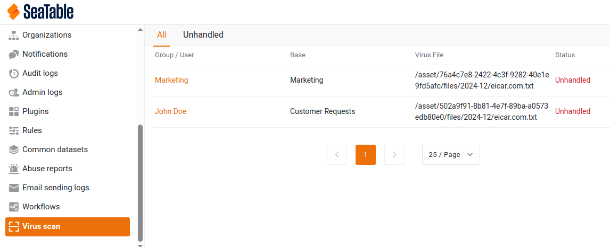

# Deploy ClamAV with SeaTable

<!-- md:version 5.2 -->
<!-- md:flag enterprise -->

SeaTable supports antivirus scanning using ClamAV. It automatically scans newly uploaded or updated assets (such as images and files) for viruses.

## Installation

### Update the .env File

To install ClamAV, add `clamav.yml` to the `COMPOSE_FILE` variable in your `.env` file. This tells Docker to download and configure the required ClamAV image.

Simply copy and paste (:material-content-copy:) the following code into your command line to update your `.env` file:

```bash
sed -i "s/COMPOSE_FILE='\(.*\)'/COMPOSE_FILE='\1,clamav.yml'/" /opt/seatable-compose/.env
```

### Configure `dtable-events.conf`

Add the following configuration to the `dtable-events.conf` file to enable virus scanning:

```conf
[VIRUS SCAN]
enabled = true
scan_command = clamdscan
scan_interval = 60
virus_code = 1
nonvirus_code = 0
```

### Start ClamAV

Start ClamAV for the first time by running:

```bash
cd /opt/seatable-compose && \
docker compose up -d
```

Once started, you should see an entry like this in your `dtable-events.log`:

```log
[INFO] virus_scanner.py[line:21] Start virus scanner, interval = 3600 sec
```

ClamAV will now continuously scan images and files attached to your bases for viruses.

## Usage

After enabling ClamAV, a new section will appear in the admin area where you can view detected viruses. For each finding, you’ll see:

- The base where the infected file is located.
- The file name.
- The current status of the detection.

You can choose to either ignore the finding or delete the infected asset.



## Advanced Topics

### Additional Configuration Options

ClamAV offers advanced configuration options in dtable-events.conf, such as:

- **Scan interval**: Adjust how often scans are performed.
- **File size limit**: Set a maximum size for scanned files.
- **Ignored file extensions**: Specify file types to exclude from scanning.
- **Thread count**: Define how many threads are used for scanning.

For more details, refer to the [dtable-events configuration documentation](../../configuration/dtable-events-conf.md).

## Updating Virus Signature Files

The ClamAV Docker container uses Freshclam to update its virus signature database automatically every three hours. While this keeps ClamAV up-to-date, its detection capabilities may not be as robust as those of other paid antivirus solutions.

## E-Mail notification

Email notifications for virus detection will be available in a future update.


