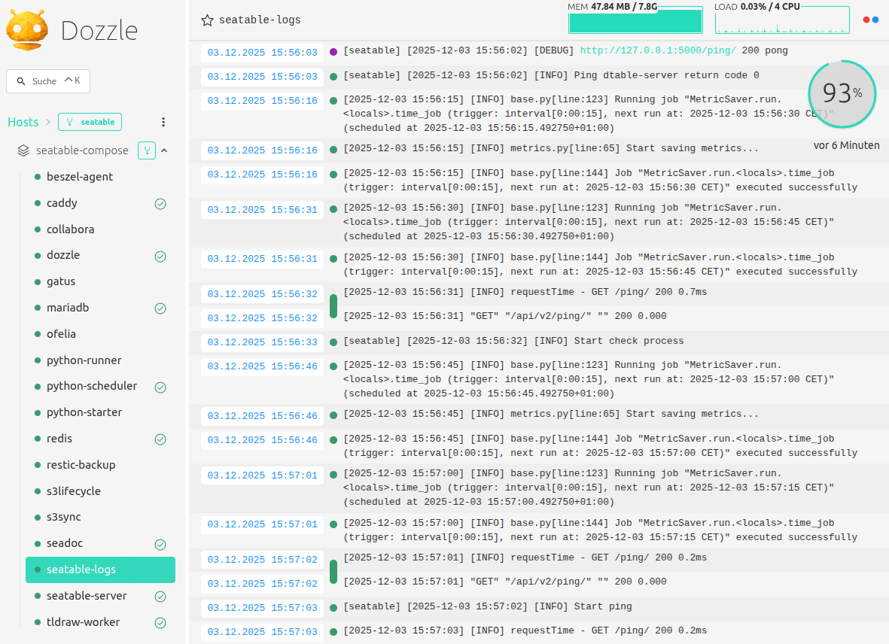

# Dozzle

<!-- md:version 6.1 -->
<!-- md:feature -->

[Dozzle](https://dozzle.dev/) is a lightweight, open-source web-based log viewer for Docker containers. It provides real-time monitoring of container logs without storing data persistently, making it ideal for quick debugging in containerized environments like SeaTable. Key features include fuzzy and regex search, SQL-based log queries, split-screen views for multiple containers, live CPU/memory stats, and multi-user authentication.

A dedicated sidecar container (`seatable-logs` based on `sumologic/tailing-sidecar`) tails SeaTable log files from `/opt/seatable-server/seatable/logs` and redirects them to stdout, enabling seamless aggregation by **Dozzle** via the Docker socket.

In a SeaTable context, it simplifies troubleshooting by aggregating logs from all services in your Docker Compose stack via the shared Docker socket.



!!! warning "Logs may contain sensitive data"

    Dozzle logs may expose sensitive information like passwords, API keys, base URLs or personal data. Restrict access to authorized users only and avoid public exposure.

## Installation

This guide explains how to install **Dozzle** on your SeaTable server.

#### Change the .env file

As with other additional components, first add `dozzle.yml` to the `COMPOSE_FILE` variable in your `.env` file.

Copy and paste (:material-content-copy:) the following command into your terminal: 

```bash
sed -i "s/COMPOSE_FILE='\(.*\)'/COMPOSE_FILE='\1,dozzle.yml'/" /opt/seatable-compose/.env
```

## Create a dozzle admin login

Dozzle requires you to create login credentials. Use the command line tool `pwgen` to create a secure password for your *dozzle admin account*.

The following command will generate the necessary file at `/opt/dozzle/users.yaml`:

```bash
export DOZZLE_PASSWORD=`pwgen -c 40 1`
docker run -it --rm amir20/dozzle generate --name DozzleAdmin --email dozzleadmin@example.com --password ${DOZZLE_PASSWORD} dozzleadmin > /opt/dozzle/users.yaml
echo 'Now you can login to dozzle with `dozzleadmin` + `'${DOZZLE_PASSWORD}'`'
```

Alternatively, you can change the command and adapt it to your needs.

!!! danger "Avoid special characters in passwords"

    When setting passwords manually (without `pwgen`), do **not** use special characters such as `%`, `#`, `$`, `&`, `'`, `"` or similar. These may cause issues and can prevent that you can login to Dozzle.

    Instead, choose a **long password** using uppercase, lowercase, and digits to ensure both compatibility and security. 

#### Start Dozzle

To start **Dozzle** for the first time, run:

```
cd /opt/seatable-compose && \
docker compose up -d
```