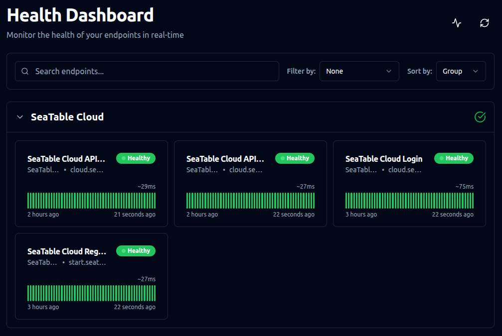

# Gatus

[Gatus](https://github.com/TwiN/gatus) provides your users with a real-time status page for your SeaTable Server and alerts you if any core components become unreachable. By default Gatus monitors the following components:

- SeaTable Login Page
- SeaTable API Gateway
- MariaDB
- Redis
- Certificate Expiration
- Python Pipeline



## Installation

This guide explains how to install **Gatus** on your SeaTable server.

#### Change the .env file

As with other additional components, first add `gatus.yml` to the `COMPOSE_FILE` variable in your `.env` file.

Copy and paste (:material-content-copy:) the following command into your terminal: 

```bash
sed -i "s/COMPOSE_FILE='\(.*\)'/COMPOSE_FILE='\1,gatus.yml'/" /opt/seatable-compose/.env
```

#### Start Gatus

To start Gatus for the first time, run:

```
cd /opt/seatable-compose && \
docker compose up -d
```

#### Verify the setup

Open `https://<your-seatable-server-hostname>/status` or `https://<your-seatable-server-hostname>:6220` in your browser to check if your new status page is accessible. This page will monitor your main components in real time. To reach this page, you must open/expose the port 6220 in your firewall.

## E-Mail notifications

Email notifications are preconfigured. You only need to provide the following environment variables in your `.env` file:

```
GATUS_EMAIL_USERNAME=
GATUS_EMAIL_PASSWORD=
GATUS_EMAIL_HOST=
GATUS_EMAIL_PORT=
GATUS_EMAIL_FROM=
GATUS_EMAIL_TO=
```

Each variable is self-explanatory.

## Additional Notifications and Advanced Configuration

Gatus uses two configuration files: `/opt/seatable-compose/gatus.yml` and `/opt/seatable-compose/config/gatus-config.yml`. 

To ensure your changes persist after updates, create copies of these files (e.g., custom-....yml) and update the references accordingly.

For all available configuration options, see the [Gatus GitHub repository](https://github.com/TwiN/gatus).

