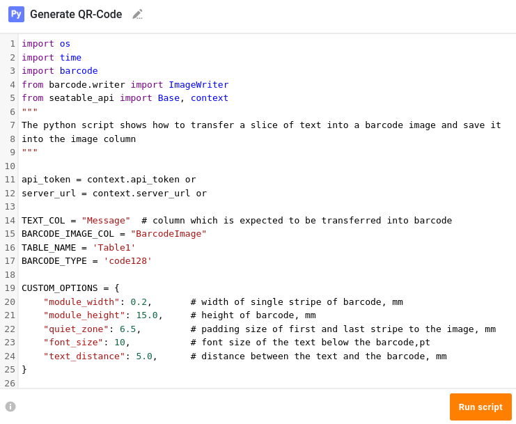
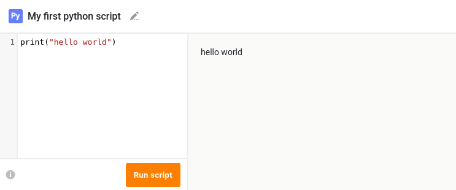

# Python Pipeline

To run Python scripts directly within SeaTable, you need to install the Python Pipeline — an environment utilizing Docker containers for script execution and result retrieval. Thanks to SeaTable's Python API, querying and manipulating data in a SeaTable base is super easy.

Explore various use cases from other SeaTable users:

- Retrieve current stock prices and store them in SeaTable.
- Validate DNS settings of specified domains for specific TXT entries.
- Capture submissions from [Jotform](https://www.jotform.com/) or [tally](https://tally.so/) and store the results.
- Identify duplicate entries and apply specific tags.

Find additional Python functions and code examples in the [SeaTable Developer Manual](https://developer.seatable.com).



## Installation

This how-to explains the deployment of the Python Pipeline next to your SeaTable Server instance.

!!! warning "Security Considerations"

    If you allow untrusted users or users with limited trust to execute Python scripts within SeaTable, you should deploy the Python Pipeline on a separate node without private network access to your SeaTable server instance.
    Please follow the [documentation](../advanced/python-pipeline-dedicated-server.md) on how to achieve this.

!!! danger "Cloud metadata endpoint reachable from scripts"

    Python scripts run as user-supplied code with outbound network access. On a cloud VM (Azure, AWS, GCP and others) a script can therefore reach the instance metadata endpoint at `169.254.169.254` and request the host's machine-identity credentials — for example an **Azure Managed Identity** or an **AWS instance profile**. If that identity has any permissions attached, a script author can use the obtained tokens to access your cloud resources.

    Until you apply a network-level block, protect your deployment as follows:

    - **Do not attach a privileged machine identity** to the VM hosting the Python Pipeline. Remove it if it is not needed, or keep it strictly least-privilege (no role assignments beyond the minimum).
    - Run the Python Pipeline on a [dedicated server](../advanced/python-pipeline-dedicated-server.md) so a script cannot reach unrelated workloads or identities.
    - **AWS only:** require IMDSv2 and set the metadata hop limit to `1` (`aws ec2 modify-instance-metadata-options --http-tokens required --http-put-response-hop-limit 1`). This blocks bridged containers automatically. Azure has no hop-limit equivalent.
    - To block reachability directly, drop egress to the metadata IP for the runner bridge on the host, e.g. `iptables -I DOCKER-USER -i br-runner -d 169.254.169.254/32 -j DROP` (scope the rule to the runner bridge — never block `169.254.169.254` host-wide, as the host itself relies on it).

#### Amend the .env file

To install the Python Pipeline, append `python-pipeline.yml` to the `COMPOSE_FILE` variable within your `.env` file. This instructs Docker to download the required images for the Python Pipeline.

Simply copy and paste (:material-content-copy:) the following code into your command line:

```bash
sed -i "s/COMPOSE_FILE='\(.*\)'/COMPOSE_FILE='\1,python-pipeline.yml'/" /opt/seatable-compose/.env
```

!!! warning "Avoid space in `COMPOSE_FILE`"

    When manually adding `python-pipeline.yml` to the `COMPOSE_FILE` variable using your preferred text editor, make sure that you do not enter a space (:material-keyboard-space:). After the modification, your `COMPOSE_FILE` variable should look like this:

    ```bash
    COMPOSE_FILE='caddy.yml,seatable-server.yml,python-pipeline.yml'
    ```

#### Generate a shared secret for secure communication

For secure communication between SeaTable and the Python Pipeline, a shared secret is required to prevent unauthorized access or usage. We recommend utilizing `pwgen` to generate a robust and secure password. Copy and paste the following command into your command line to generate a password:

```bash
pw=$(pwgen -s 40 1) && echo "Generated shared secret: ${pw}"
```

The generated shared secret needs to be added to your `.env` file. Copy and paste the following command:

```bash
echo -e "\n# python-pipeline" >> /opt/seatable-compose/.env
echo "ENABLE_PYTHON_SCRIPT=true" >> /opt/seatable-compose/.env
echo "PYTHON_SCHEDULER_AUTH_TOKEN=${pw}" >> /opt/seatable-compose/.env
```

#### Start the Python Pipeline

Now it is time to start the Python Pipeline.

```bash
cd /opt/seatable-compose && \
docker stop seatable-server && \
docker compose up -d
```

#### Check the functionality Python Pipeline

Do you want to execute your first Python script in SeaTable? Nothing easier than that.

- Login to your SeaTable Server.
- Create a new base and open it.
- Add a Python script with the content `print("Hello World")` and execute it. If you don't know how to do this, check out our [user manual](https://seatable.com/help/create-delete-script-seatable).

If everything went well, you should see the output `Hello World`.



:material-party-popper: **Great!** Your SeaTable Server instance can now run Python scripts.
