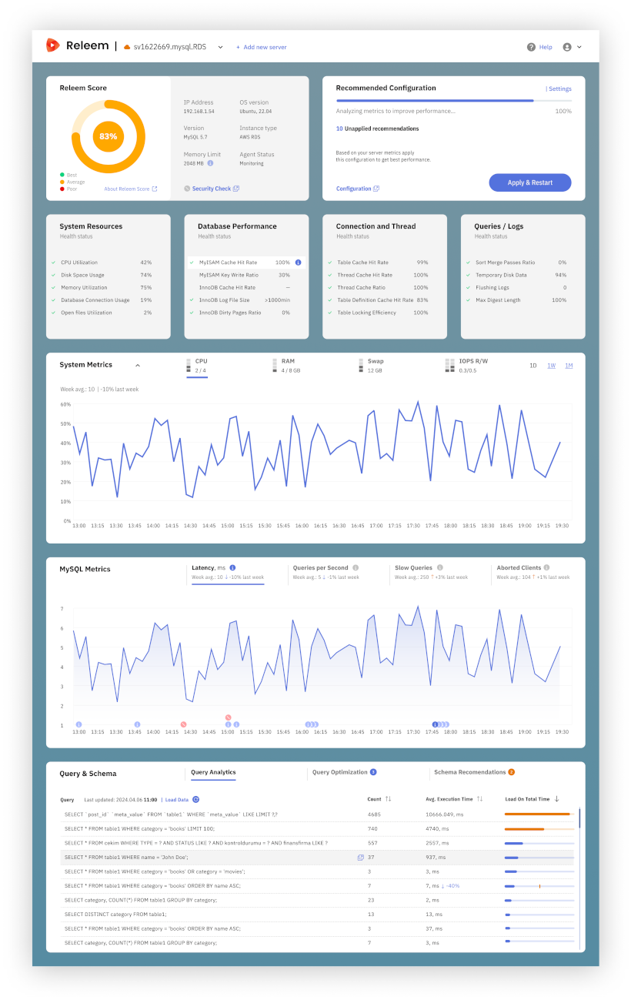

# Releem

**Releem** is a MySQL performance monitoring and tuning tool designed to optimize your MariaDB database. It operates alongside your database, collecting performance data and providing recommended configuration improvements. While Releem offers automated insights, experienced database professionals may prefer manual tuning for deeper control.



## Register for a releem account

- Visit the [Releem website](https://releem.com/) and sign up for a new account.
- After registration, obtain your **RELEEM_API_KEY**.

## Create a dedicated database user

Releem requires its own user in your MariaDB instance. Log in to your MariaDB server and execute the following commands, replacing `[RELEEM_DB_USER_PASSWORD]` with a secure password:

```sql
CREATE USER 'releem'@'%' identified by '[RELEEM_DB_USER_PASSWORD]';
GRANT PROCESS, REPLICATION CLIENT, SHOW VIEW ON *.* TO 'releem'@'%';
GRANT SELECT ON performance_schema.events_statements_summary_by_digest TO 'releem'@'%';
GRANT SELECT ON performance_schema.table_io_waits_summary_by_index_usage TO 'releem'@'%';
```

## Configure Releem in your environment 

Add `releem.yml` to the `COMPOSE_FILE` variable in your `.env` file and set the following environment variables:

- **RELEEM_HOSTNAME**: A unique identifier for your server (useful if monitoring multiple systems).
- **RELEEM_DB_USER_PASSWORD**: The password you set above.
- **RELEEM_API_KEY**: Your API key from Releem.

## Data collection and optimization

After starting the Releem agent, it will begin collecting performance metrics from your MariaDB database. Within 24 hours, Releem will provide optimized configuration recommendations based on your database workload.

## Apply optimized MariaDB settings

1. **Create a Custom Configuration File**  

    Create a file named `99-mariadb-custom.cnf` with your optimized settings that Releem recommended to you. 
    
    **This is just an example:**

    ```ini
    [mariadb]
    query_cache_limit       = 1M
    query_cache_size        = 128M
    expire_logs_days        = 10
    innodb_buffer_pool_size = 1946157056
    ```

2. **Mount the Configuration File in Your Docker Compose Setup**  

    Add the following volume to your `docker-compose.yml` for the MariaDB service:

    ```
    ---
    services:
    mariadb:
        ...
        volumes:
        - "/opt/mariadb:/var/lib/mysql"
        - "./99-mariadb-custom.cnf:/etc/mysql/conf.d/99-mariadb-custom.cnf"
    ```

3. **Restart MariaDB**  

    Restart your MariaDB container to apply the new settings.

    After the restart, your database will use the new configuration. Releem will continue to monitor and suggest further optimizations as needed.
