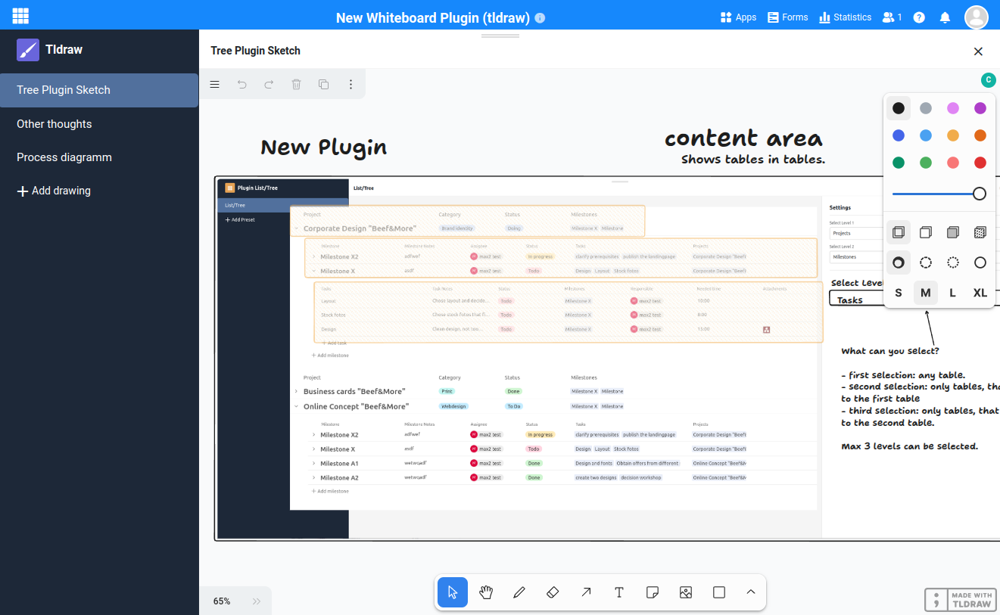

# Whiteboard (tldraw)

<!-- md:version 5.2 -->
<!-- md:flag enterprise -->

SeaTable's whiteboard plugin offers a versatile platform for capturing thoughts and data, independent of base data. This plugin utilizes the [tldraw SDK](https://tldraw.dev) and requires special installation steps, including server-side components for collaborative drawing.



## Installation Requirements

1. SeaTable Enterprise Edition installed and running
2. Firewall configured to allow traffic on port 6239
3. System admin to install both the whiteboard plugin and the tldraw worker (server component)

## tldraw-worker Installation

Follow these steps to deploy the tldraw worker on the same node as the seatable-server:

#### Update .env file

Like with all additional components you need to add `tldraw.yml` to the `COMPOSE_FILE` variable in your `.env` file.

Simply copy and paste (:material-content-copy:) the following code into your command line:

```bash
sed -i "s/COMPOSE_FILE='\(.*\)'/COMPOSE_FILE='\1,tldraw.yml'/" /opt/seatable-compose/.env
```

#### Launch the worker

Start the `tldraw-worker`:

```bash
cd /opt/seatable-compose && \
docker compose up -d
```

#### Verify Installation

After a few seconds, check `https://<your-seatable-url>:6239/ping`. You should see:

```
{"status":"pong"}
```

This confirms that the `tldraw-worker` is operational. If you don't see this message, check that port 6239 is allowed and the container logs.

## Final Steps

With the server-side installation complete, you can now install the **whiteboard plugin** through the SeaTable admin interface and begin using this creative tool.

---

## Advanced Configuration

### Custom Certificate

You need to make some changes to your `tldraw-worker` deployment in case your SeaTable server uses an internal CA.
It is not recommended to make changes to the provided `tldraw.yml` file.
You should copy `tldraw.yml` to `custom-tldraw.yml` and reference this file in your `.env` file instead.

The following changes need to be made in order to use an internal CA:

```yaml
services:
  tldraw-worker:
    # ...
    environment:
      # ...
      # Configure Extra CA (chain) for node.js
      - NODE_EXTRA_CA_CERTS=/usr/local/share/ca-certificates/MY-CA.pem
    volumes:
      # Mount the CA file into the container
      - ./MY-CA.pem:/usr/local/share/ca-certificates/MY-CA.pem:ro
```

### Subfolder Installation

Deploying the tldraw-worker using a subfolder (e.g. `/tldraw`) instead of port 6239 is **not yet supported**.

You can refer to the following forum post for details regarding the required changes in your reverse proxy and the whiteboard plugin itself: [forum.seatable.com/t/configuring-new-whiteboard-plugin-tldraw/6482](https://forum.seatable.com/t/configuring-new-whiteboard-plugin-tldraw/6482)
