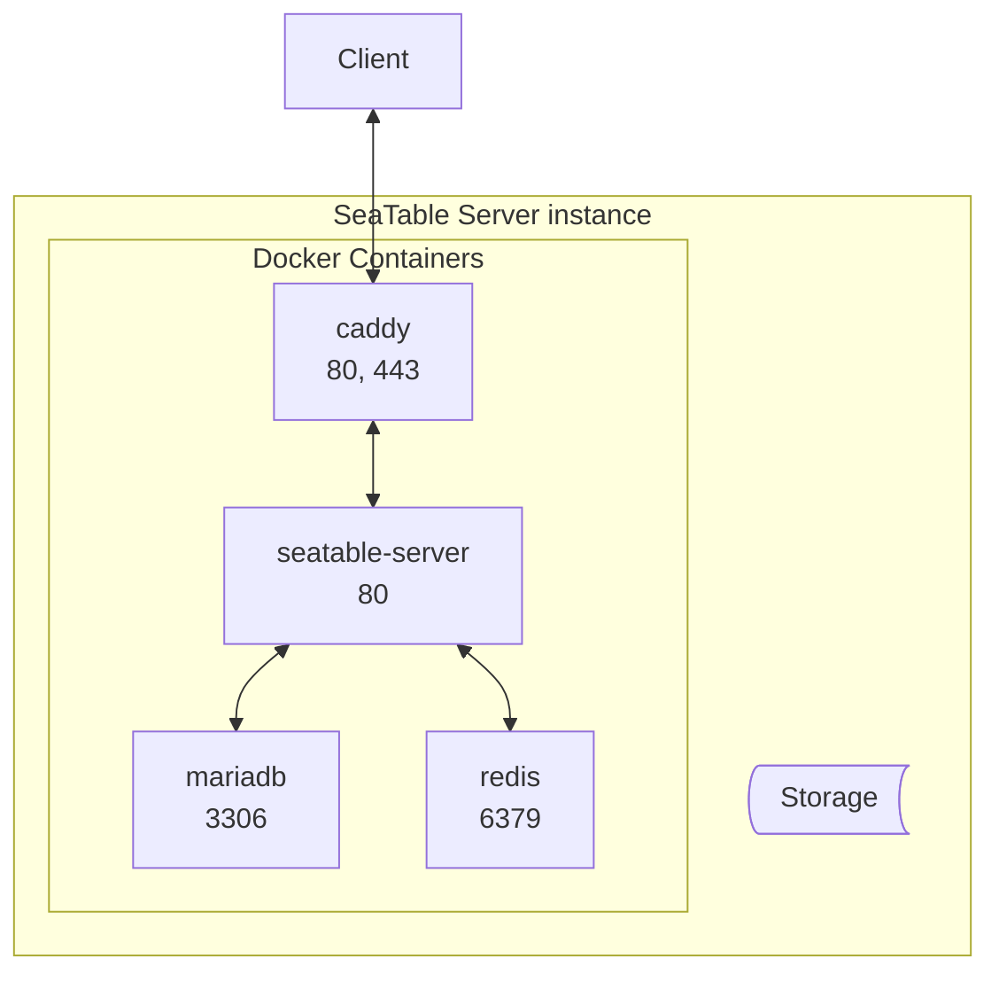
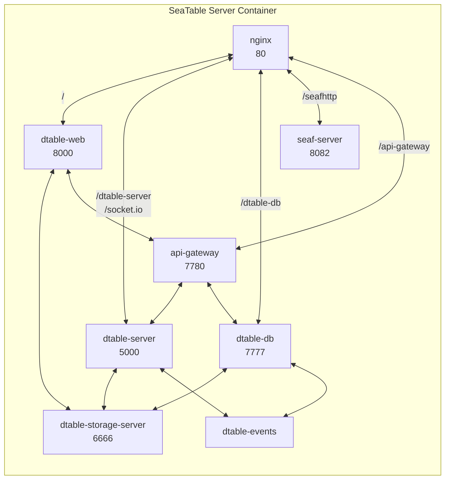

# Architecture

## Overview

SeaTable Server uses Docker/Docker Compose for easy deployment and upgrades.

A SeaTable Server instance consists of a handful of Docker containers. The following diagram is a simplified representation of the required Docker containers deployed in the [single node setup](../../installation/basic-setup/).



The numbers designate the ports used by the containers. Port 443 in the container `caddy` must be exposed. Port 80 must also be exposed when a Let's Encrypt SSL certificate is to be used.  All other ports are internal ports that are only available within the Docker network.

All Docker containers read from and write to local storage. The containers `caddy`, `seatable-server`, and `mariadb` employ Docker volumnes.

<!--In an extended setup, additional, optional Docker container can be deployed to add functionality to SeaTable Server. The diagram below describes all Docker containers and their interactions required for a SeaTable Server instance integrated with office editor, Python pipeline, virus scan, and whiteboard.

The rest of this article focuses exclusively on the required containers and components of a SeaTable Server instance.-->

## Container caddy

Caddy is a flexible web proxy. Its job is to offer a central gateway for the SeaTable Server instance.

Caddy is easy to configure and excels at facilitating SSL configuration and management, either with Let's Encrypt or custom certificates.

## Container seatable-server

The container `seatable-server` is home to several services. The nginx service is the gateway in the container.



### dtable-web

The task of the service dtable-web is to deliver all pages except for the bases themselves. This includes essential features such as the login page, home page, system administration area, team administration, personal settings, and API endpoints. All these functionalities are provided by dtable-web, which is built on the Django framework.

### dtable-server

When accessing a base, you'll be directed to the base editor, which is provided by the dtable-server service. This editor loads the base's content from a JSON file, presenting it in a familiar spreadsheet interface and enabling real-time collaborative work on all data within the base. Each modification is promptly saved to the operation log (stored in MariaDB), and within minutes, these changes are persisted as a JSON file and transmitted to dtable-storage-server for storage in the attached storage system.

### dtable-db

dtable-db extends the functionality of dtable-server, offering an SQL-like query language to interact with base data. Additionally, it serves as the interface for accessing the Big Data Backend.

### seaf-server

When utilizing a file or image column in your base, the actual files are stored separately from the JSON object, with the JSON object containing only links to these files. The seaf-server service manages the storage and retrieval of these files, ensuring they can be accessed within the base. Seafile currently supports local storage or S3 storage, and seaf-server is responsible for appropriately storing the files based on the chosen storage method.

### dtable-storage-server

The dtable-storage-server is a simple abstract layer upon the chosen storage. SeaTable Server support file system and S3-compatible object storage.

### dtable-events

When actions are not executed immediately but with a time delay, SeaTable employs the dtable-events service, essentially the interface to the Redis cache. dtable-events effectively manages various tasks and their status, ensuring efficient task execution within the system.

### api-gateway

The api-gateway is as a proxy for dtable-server and dtable-db. All API calls for [base operations](https://api.seatable.io/reference/getbaseinfo) are routed through this component. It also essential for the effective enforcement of API rate and request limits.

## Container mariadb

SeaTable uses MariaDB to store user, group and team information as well as metadata for bases. Additionally, MariaDB stores the operation log. The operation log (saved in the database table `dtable_db.operation_log`) is the base journal. It records all modifications made within all bases of the SeaTable Server instance. (While SeaTable stores all base modifications in MariaDB, but it doesn't store the actual base content. Instead, bases are managed within dtable-server and regularly persisted to dtable-storage-server for long-term storage.)

SeaTable Server uses four database tables:

- ccnet_db: information about users, groups and teams (or organizations)
- seafile_db: metadata information of the file storage
- dtable_db: application level data, including base metadata, operation log, sessions, automation rules
- scheduler: log information for SeaTable Server's Python Pipeline

## Container redis

Redis, an in-memory data store, performs several tasks for a SeaTable Server instance:

- Caching for Django, which is used for SeaTable's web interface and all API endpoints
- Cache application level data obtained from databases (e.g. session cache, user information cache, group and organization list cache)
- Sending messages from dtable-web/dtable-server to dtable-events - it servers as an event queue to save internal tasks and statuses

!!! warning "Redis has replaced Memcached"

    In versions up to SeaTable Server 5.1, Memcached, an in-memory key-value store, was used to cache the Django framework.

## Storage

By default, SeaTable Server stores user data in the following structure on the local disk:
```bash
/opt/seatable-server/seatable
├── conf
├── db-data
├── logs
├── pids
├── scripts
├── seafile-data
├── seahub-data
└── storage-data
```

These directories contain the following content:

- conf: configuration files for SeaTable Server components (see [Configuration](../../configuration/dtable-web-settings/))
- logs: log files generated by SeaTable Server components (see [Logging](../../maintenance/logs/))
- db-data: data stored in big data storage
- seahub-data: avatars and image thumbnails
- storage-data: base data, base snapshots, and backup of big data
- seafile-data: assets (files and images) saved in bases

`/opt/seatable-server/` is mounted as a Docker volume in the Docker container `seatable-server` when SeaTable Server is started.

SeaTable can, depending on the [configuration](../../installation/advanced/s3/), store the following items in S3 buckets instead of in the file system:

- storage-data
- seafile-data
- avatars in seahub-data

(The content of the data in db-data cannot be stored in S3 due to it ideosyncratic format.)


## SeaTable Backends

SeaTable employs two distinct backends: the **default backend**, which supports all features including real-time collaboration in the base editor, and the **big data backend**.

The latter was developed to address a technical size limitation, which by default restricts the maximum number of rows within a base to 100k. The Big Data backend enables the storage of millions of rows in a single base, overcoming this limitation. However, due to the vast amount of data handled, not all functions are supported by the big data backend. Particularly, real-time collaboration is not supported for data stored in the big data backend.

### Default Backend (JSON-file based backend)

The core of a SeaTable Server lies in its base editor, facilitating real-time collaborative work directly within the browser.

When a base is opened in the base editor, dtable-server initiates a request to the dtable-storage-server to retrieve the corresponding JSON-file from storage. Subsequently, dtable-server renders the base and loads its content into the server's memory. All modifications are stored in memory and simultaneously recorded in the operation log within the MariaDB database. Every five minutes, dtable-server automatically saves these changes to the file system, persisting them in the JSON-file.

Furthermore, the dtable-storage-server generates a snapshot of the base every 24 hours, capturing any changes that have occurred in the interim. Essentially, a snapshot is a complete copy of the JSON-file.


!!! warning "Why are the bases not stored in MariaDB?"

    Initially, it may seem counterintuitive that SeaTable saves base data in a JSON-file rather than directly in the MariaDB database. However, this decision stems from the efficiency of SQL tables in handling vast numbers of rows. The challenge arises when altering the database structure, such as adding new columns, renaming columns, or changing column types in a table containing hundreds of thousands of rows. In such cases, direct database storage proves inefficient.

To address this issue, SeaTable opts to persist base data in JSON-files instead. While this JSON-based backend approach offers flexibility, it also imposes a limitation on base size. A technical constraint of 200MB per JSON-object translates to a default maximum of 100k rows per base. When nearing this limit, records can be transferred to the Big Data storage via the archive view operation, mitigating potential issues.

### Big Data Backend (SQL-like database)

The second backend, known as the _big data backend_, diverges from the conventional JSON-file storage method by utilizing an SQL-like database capable of accommodating millions of rows within a base. [Activating the Big Data backend](https://seatable.io/docs/big-data/aktivieren-des-big-data-backends-in-einer-base/?lang=auto) for a base prompts SeaTable to create a new database structure tailored to accommodate large datasets.

To access data stored in the big data backend, users must create a [Big Data View](https://seatable.io/docs/big-data/so-erstellen-sie-ein-big-data-ansicht/), which, unlike conventional views, loads a preview of up to 1k rows by default. To retrieve additional rows, users can make requests within the web interface to get more data.

Unlike the default backend, the Big Data backend does not load data into the server's memory, rendering real-time collaboration unsupported. Given the challenges of interacting with millions of rows within a browser-based spreadsheet interface, users typically access such large datasets via the **SQL query Plugin**, the [SeaTable API](https://api.seatable.io) or through the SQL-like query language provided by dtable-db.
