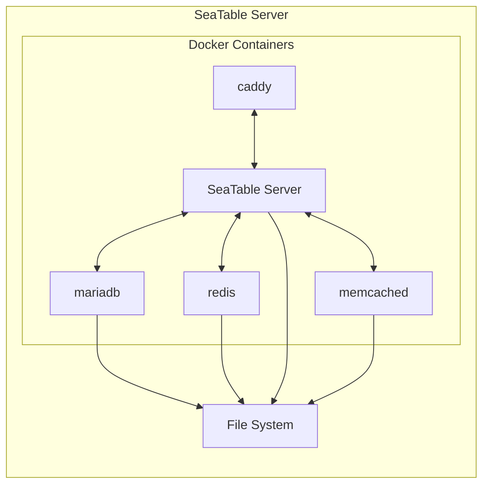
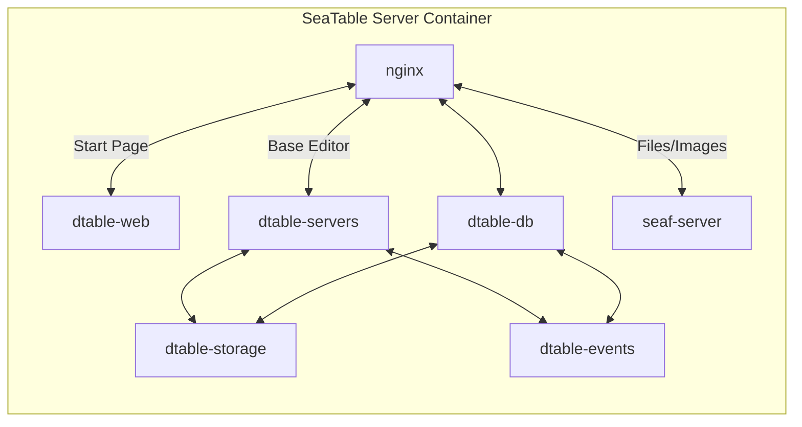

# Architecture

## SeaTable Docker Containers

A SeaTable Server consists of a handful of docker containers, which are all required to work properly. The SeaTable server contains multiple functions that will be explained within this article.

Please note that the following diagram is a simplified representation of the main containers. Further elaboration and detailed insights will be provided in subsequent sections of this manual

In the following the purpose of these containers should be explained in more details.

??? info "Caddy: the flexible web proxy"

    The only task of caddy is to offer a central way into the SeaTable Server. Caddy makes TLS termination with Let's Encrypt or the usage of custom certificates super easy.

??? info "mariadb: the database to store user accounts, metadata and the operation log"

    Every software requiring data storage necessitates a database, and SeaTable utilizes MariaDB to store essential persistent data such as user information, the base list and group details. Additionally, the operation log, capturing every change within a base, is stored within MariaDB.

    It's crucial to clarify a common misconception: while MariaDB saves changes of a base inside the so called *operation log*, it doesn't store the actual content of SeaTable bases. Instead, bases are managed within dtable-server and regularly persisted to dtable-storage-server for long-term storage.

??? info "redis: Internal events queue"

    Redis is used for sending messages from dtable-web/dtable-server to dtable-events. It is like an event queue to save internal tasks and statuses.

??? info "memcache: Caching for the Django framework"

    Memcache is used to provide caching for the Django framework which is the basis for the webinterface and all API endpoints of SeaTable. Memcache might be replaced in the near future with redis.

## SeaTable Server Container

Let's look at the `SeaTable Server` container in more details to get a feeling about the different services delivered with this container. Also this graph is simplified for explanatory reasons. It should explain the connections and logics and should not be super precise.

??? abstract "dtable-web: The website for manage bases"

    The task of the service `dtable-web` is to deliver all pages except for the bases themselves. This includes essential features such as the login page, home page, system administration area, team administration, personal settings, and API endpoints. All these functionalities are provided by dtable-web, which is built on the Django framework.

??? abstract "dtable-server: Store the bases and provide collaborating feature"

    When accessing a base, you'll be directed to the base editor, which is provided by the `dtable-server` service. This editor loads the base's content from a JSON file, presenting it in a familiar spreadsheet interface and enabling real-time collaborative work on all data within the base. Each modification is promptly saved to the operation log (stored in mariadb), and within minutes, these changes are persisted as a JSON file and transmitted to dtable-storage-server for storage in the attached storage system.

??? abstract "dtable-db: Provide big data storage and SQL query interface"

    `dtable-db` extends the functionality of `dtable-server`, offering an SQL-like query language to interact with base data. Additionally, it serves as the interface for accessing the Big Data Backend.

??? abstract "dtable-events: Background tasks likes email sending"

    When actions are not executed immediately but with a time delay, SeaTable employs the `dtable-events` service, essentially the interface to the Redis cache. `dtable-events` effectively manages various tasks and their status, ensuring efficient task execution within the system.

??? abstract "seaf-server: Store attachments (files and images)"

    When utilizing a file or image column in your base, the actual files are stored separately from the JSON object, with the JSON object containing only links to these files. The `seaf-server` service manages the storage and retrieval of these files, ensuring they can be accessed within the base. Seafile currently supports local storage or S3 storage, and seaf-server is responsible for appropriately storing the files based on the chosen storage method.

??? abstract "dtable-storage-server: Interface to the storage"

    The `dtable-storage-server` is a simple abstract layer upon the chosen storage method. This could be either file storage or S3-like object storage.

## SeaTable Backends

SeaTable employs two distinct backends: the **default backend**, which supports all features including real-time collaboration in the base editor, and the **Big Data backend**.

The latter was developed to address a technical size limitation, which by default restricts the maximum number of rows within a base to 100,000. The Big Data backend enables the storage of millions of rows in a single base, overcoming this barrier. However, due to the vast amount of data handled, not all functions are supported by the Big Data backend. Particularly, real-time collaboration in the browser is not possible with this backend.

### Default backend (JSON-file based backend)

The core of a SeaTable Server lies in its base editor, facilitating real-time collaborative work directly within the browser.

When a base is opened in the base editor, `dtable-server` initiates a request to the `dtable-storage-server` to retrieve the corresponding JSON file from storage. Subsequently, `dtable-server` renders the base and loads its content into the server's memory. All modifications are stored in memory and simultaneously recorded in the operation log within the MariaDB database. Every five minutes, `dtable-server` automatically saves these changes to the file system, persisting them in the JSON file.

Furthermore, the `dtable-storage-server` generates a snapshot of the base every 24 hours, capturing any changes that have occurred in the interim. Essentially, a snapshot is a complete copy of the JSON file.

!!! warning "Why are the bases not stored in mariadb?"

    Initially, it may seem counterintuitive that SeaTable saves base data in a JSON file rather than directly in the MariaDB database. However, this decision stems from the efficiency of SQL tables in handling vast numbers of rows. The challenge arises when altering the database structure, such as adding new columns, renaming columns, or changing column types in a table containing hundreds of thousands of rows. In such cases, direct database storage proves inefficient.

To address this issue, SeaTable opts to persist base data in JSON files instead. While this JSON-based backend approach offers flexibility, it also imposes a limitation on base size. A technical constraint of 200 MB per JSON object translates to a default maximum of 100,000 rows per base. When nearing this limit, records can be transferred to the Big Data storage via the archive view operation, mitigating potential issues.

### Big Data backend (SQL-like database)

The second backend, known as the _Big Data backend_, diverges from the conventional JSON file storage method by utilizing an SQL-like database capable of accommodating millions of rows within a base. [Activating the Big Data backend](https://seatable.io/docs/big-data/aktivieren-des-big-data-backends-in-einer-base/?lang=auto) for a base prompts SeaTable to create a new database structure tailored to accommodate large datasets.

To access data stored in the Big Data backend, users must create a [Big Data View](https://seatable.io/docs/big-data/so-erstellen-sie-ein-big-data-ansicht/), which, unlike conventional views, loads a preview of up to 1,000 rows by default. To retrieve additional rows, users can make requests within the web interface to get more data.

Unlike the default backend, the Big Data backend does not load data into the server's memory, rendering real-time collaboration unsupported. Given the challenges of interacting with millions of rows within a browser-based spreadsheet interface, users typically access such large datasets via the **SQL-query Plugin**, the [SeaTable API](https://api.seatable.io) or through the SQL-like query language provided by dtable-db.
