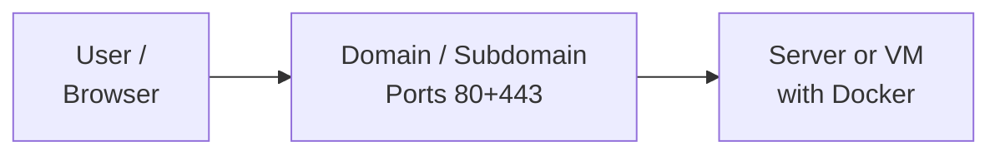

# Requirements

One of the main advantages of SeaTable against other solutions is, that you can run SeaTable on your own hardware or on any server your like. Still there are some requirements:

- Linux-Server with Root-Shell
- Public domain pointing to your server
- Open Ports for HTTP and HTTPS access (probably more ports for other components)
- The ports should not be already in use by another proxy such as NGINX or Apache

Does this sounds complicated? Not really. So lets get started.

[Let's begin with the installation in the root-shell](/installation-rework/basic-setup/){ .md-button .md-button--primary }

If you need more information, you can get more details in this article.

## Platform support

SeaTable uses `docker` and `docker compose`. Therefore it should run as long as docker virtualisation is available. Still we recommend **Debian 11 or newer** because we always use Debian for production and testing.

Currently only x86/x64 architecture is officially supported. Bigger customers might get support with ARM based systems.

## Hardware

SeaTable Server requires at least

- 4 CPU cores
- 8 GB RAM
- 50 GB SSD

These resources guarantee good performance for most applications with up to 100 users. When bases become large or the number of users increase, **more RAM** is needed since SeaTable stores the bases in memory. More CPU could help, but has much lower impact on system performance.

As soon as you have more than 100 users, you should consider extending your SeaTable Platform and move some components to separate VMs.

!!! warning "Additional components need additional ressources"

    These hardware requirements are for SeaTable Server. If you install additional components like n8n, collabora online or onlyoffice the requirements for these ressources stack up and you have to add additional ressources.

For sure we need a **root shell** on this server to execute the installation commands.

## Public available domain

This manual assumes that you have **one domain or subdomain** that points to your public IP address of your server.

For sure, it is possible to run SeaTable without an internet connection (air-gapped) or with custom SSL certificates. This requires additional settings which are explained in separate chapters.

## Ports

SeaTable needs by default only the default ports **80 (HTTP)** and **443 (HTTPS)**.

Most of the [additional components](/installation-rework/components/) will require **additional ports** in the range of **6230 to 6240**. You have to open the firewall or create port forwardings if you want to use these functions. If you don't use this component, the port can stay closed.

### List of required ports

- **80**: HTTP access is necessary to receive a Let's Encrypt certificate
- **443**: HTTPS is the main entrance to SeaTable Server

### List of optional ports

- **6230**: Uptime Kuma
- **6231**: n8n
- **6232**: Collabora Online
- **6233**: OnlyOffice
- **6235**: Zabbix

## License

**SeaTable Enterprise Edition** requires a license to start. A free license for two years and three users can be obtained at [https://seatable.io/on-premises](https://seatable.io/on-premises) or via the command line, which will be explained during the installation. Licenses with more than three users can be obtained from SeaTable Sales. [Just contact us and ask for a quote](https://seatable.io/kontakt/?lang=auto).

**SeaTable Developer Edition** does not require a license.
