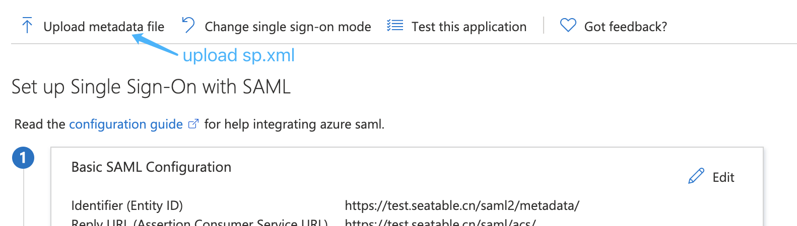

# SAML SSO

In this document, we use Azure SAML to show the steps to connect SeaTable with SAML. Other SAML provider should be similar.

## Prepare Certs File

Create certs dir

```
docker exec -it seatable bash
cd /opt/seatable
mkdir certs
cd certs
```

You can generate them by:

```
openssl req -x509 -nodes -days 365 -newkey rsa:2048 -keyout sp.key -out sp.crt
```

## Configure Azure SAML

Add application: <https://docs.microsoft.com/en-us/azure/active-directory/manage-apps/add-application-portal>

Assign users: <https://docs.microsoft.com/en-us/azure/active-directory/manage-apps/add-application-portal-assign-users>

Set up SSO: <https://docs.microsoft.com/en-us/azure/active-directory/manage-apps/add-application-portal-setup-sso>


Set user attributes: <https://docs.microsoft.com/en-us/azure/active-directory/develop/reference-claims-mapping-policy-type>


Download base64 format signing certificate and metadata XML file, put them under the certs(/opt/seatable/certs) directory.


## Configure SeaTable

Add the following configuration to dtable_web_settings.py

```
ENABLE_SAML = True
SAML_METADATA_REMOTE_URL = 'https://login.microsoftonline.com/xxx/federationmetadata/2007-06/federationmetadata.xml?appid=xxx'
SAML_PROVIDER_DOMAIN = 'Azure_saml2'
SAML_ATTRIBUTE_MAP = {
    'uid': 'uid',
    'ContactEmail': 'contact_email',
    'DisplayName': 'name',
}
SAML_ENTITY_ID = 'https://test.seatable.cn/saml2/metadata/'

# The following configuration is to generate SP metadata
from os import path
import saml2
import saml2.saml

CERTS_DIR = '/opt/seatable/certs/'
SP_SERVICE_URL = 'https://test.seatable.cn'
XMLSEC_BINARY = '/usr/bin/xmlsec1'
SAML_CONFIG = {
    'xmlsec_binary': XMLSEC_BINARY,   # full path to the xmlsec1 binary programm
    'allow_unknown_attributes': True,
    'entityid': SP_SERVICE_URL + '/saml2/metadata/',   # your entity id
    # this block states what services we provide
    'service': {
        # we are just a lonely SP
        'sp' : {
            "allow_unsolicited": True,
            'name': 'Federated Seafile Service',
            'name_id_format': saml2.saml.NAMEID_FORMAT_EMAILADDRESS,
            'required_attributes': ["uid"],   # attributes that this project need to identify a user
            'optional_attributes': ['eduPersonAffiliation', ],   # attributes that may be useful to have but not required
            'endpoints': {
                'assertion_consumer_service': [
                    (SP_SERVICE_URL + '/saml/acs/', saml2.BINDING_HTTP_POST),
                ],
            },
            'idp': {
                # SAML_METADATA_REMOTE_URL
                'https://login.microsoftonline.com/xxx/federationmetadata/2007-06/federationmetadata.xml?appid=xxx': {
                    'single_sign_on_service': {
                        # SingleSignOnService
                        saml2.BINDING_HTTP_REDIRECT: 'https://login.microsoftonline.com/xxx/saml2',
                    },
                    'single_logout_service': {
                        # SingleLogoutService
                        saml2.BINDING_HTTP_REDIRECT: 'https://login.microsoftonline.com/xxx/saml2',
                  },
                },
            },
        },
    },
    'metadata': {
        'local': [path.join(CERTS_DIR, 'idp_federation_metadata.xml')],   # where the remote metadata is stored
    },
    'debug': 1,   # set to 1 to output debugging information
    'cert_file': path.join(CERTS_DIR, 'idp.crt'),   # Signing from IdP
    'encryption_keypairs': [{
        'key_file': path.join(CERTS_DIR, 'sp.key'),  # private part
        'cert_file': path.join(CERTS_DIR, 'sp.crt'),  # public part
    }],
    'valid_for': 24,  # how long is our metadata valid
}

```

### Upload the metadata of SeaTable

Restart SeaTable, enter the entity id URL of SeaTable in the browser, e.g. <https://test.seatable.cn/saml2/metadata/>, download the web page content to the local, name it sp.xml, and upload it to the Azure SAML application.



Log in to the SeaTable homepage, click single sign-on, and use the user assigned to Azure SAML to perform a SAML login test.
