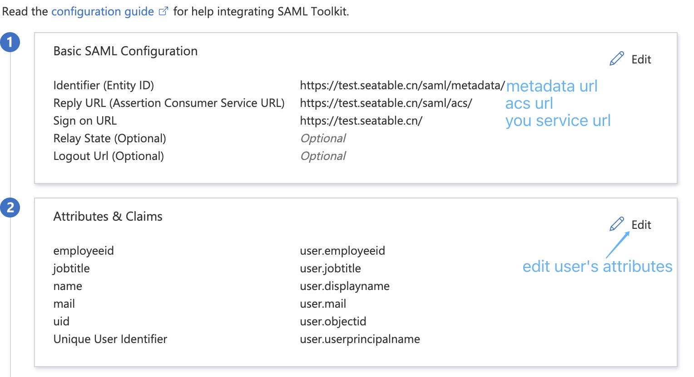
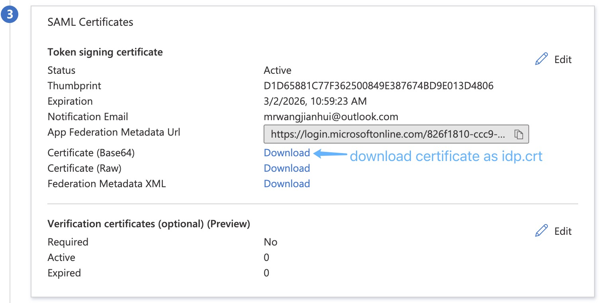

# SAML SSO

In this document, we use Azure SAML to show the steps to connect SeaTable with SAML. Other SAML provider should be similar.

1\. Prepare Certs File

Create certs dir

```
$ docker exec -it seatable bash
# mkdir -p /opt/seatable/seahub-data/certs
```

You can generate them by:

```
# cd /opt/seatable/seahub-data/certs
# openssl req -x509 -nodes -days 3650 -newkey rsa:2048 -keyout sp.key -out sp.crt
```

2\. Configure SeaTable

Add the following configuration to dtable_web_settings.py and then restart SeaTable:

```python
ENABLE_SAML = True
SAML_REMOTE_METADATA_URL = 'https://login.microsoftonline.com/xxx/federationmetadata/2007-06/federationmetadata.xml?appid=xxx'
SAML_PROVIDER_IDENTIFIER = 'azure'
SAML_ATTRIBUTE_MAP = {
    'uid': 'uid',
    'mail': 'contact_email',
    'name': 'name',
    'employeeid': 'employee_id',
    'jobtitle': 'user_role',
}
```

`SAML_PROVIDER_IDENTIFIER` is used in SeaTable internally to distinguish different SSO provider for the same user.


__Note__: If the certificate is **not placed in** the `/opt/seatable/seahub-data/certs` directory, you need to add the following configuration in dtable_web_settings.py:

```python
SAML_CERTS_DIR = '/path/to/certs'
```

3\. Configure Azure SAML

Add application: <https://docs.microsoft.com/en-us/azure/active-directory/manage-apps/add-application-portal>

Assign users: <https://docs.microsoft.com/en-us/azure/active-directory/manage-apps/add-application-portal-assign-users>

Set up SSO with SAML: 



4\. Upload Azure AD certificate

Download base64 format signing certificate, put it under the certs(/opt/seatable/seahub-data/certs) directory.



5\. Log in to the SeaTable homepage, click single sign-on, and use the user assigned to Azure SAML to perform a SAML login test.
